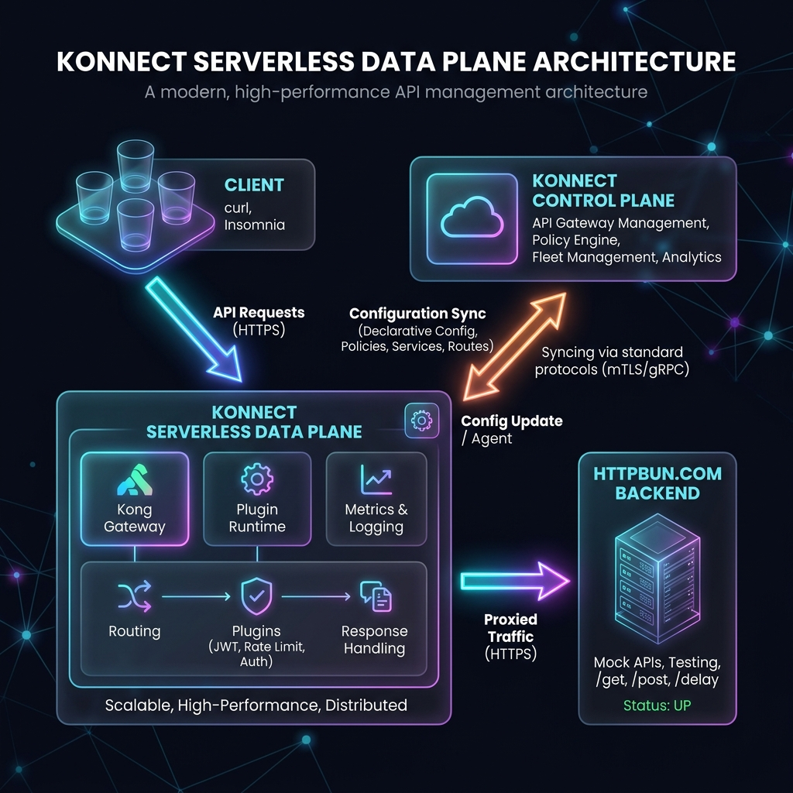
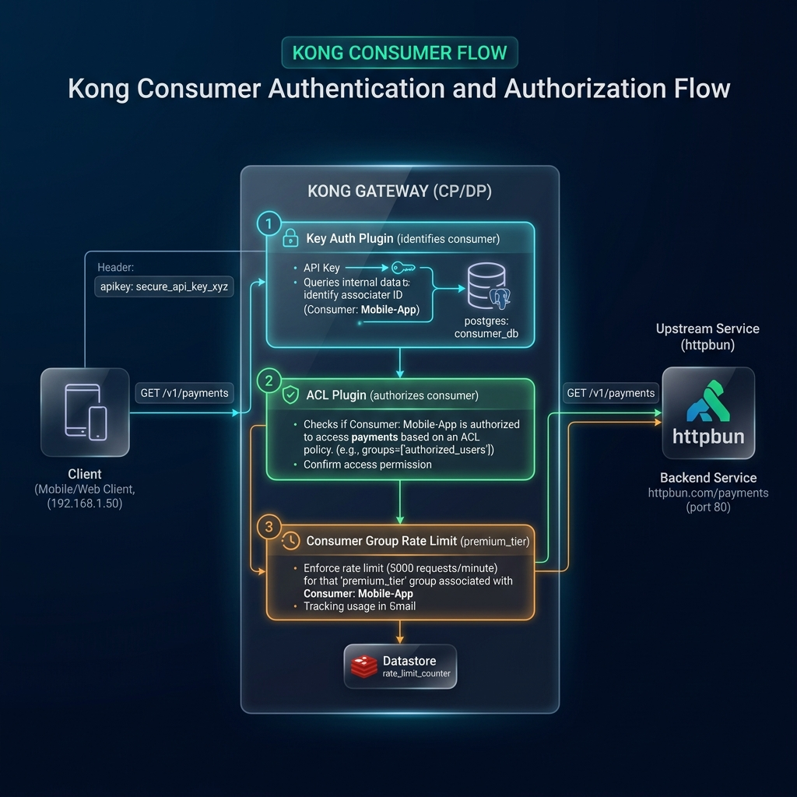
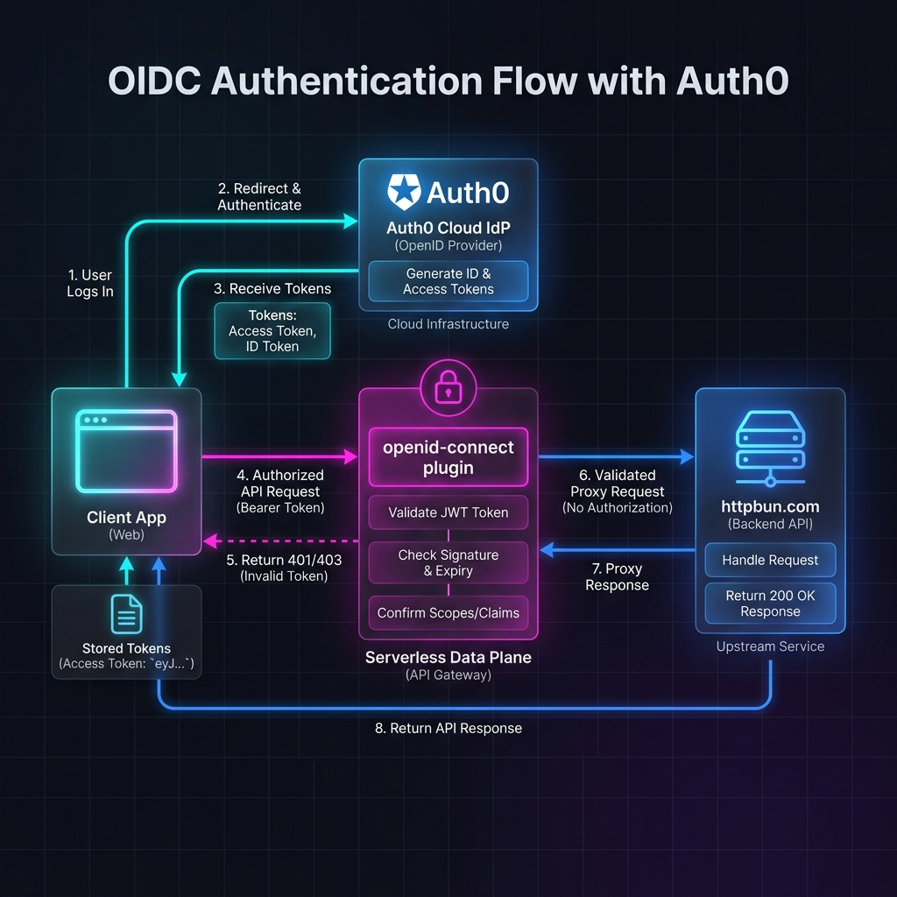
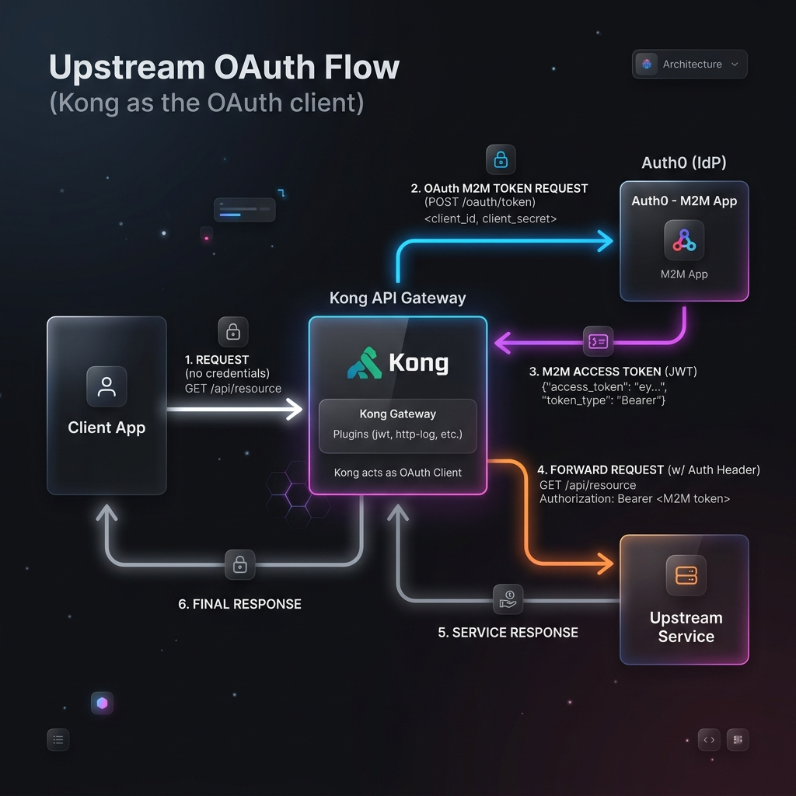

# Kong API Gateway Bootcamp

> **Deployment:** Konnect Control Plane + Konnect Serverless Data Plane
>
> 17-step hands-on lab covering core gateway plugins, consumer management,
> Kong Identity (M2M), OpenID Connect with Auth0, and Upstream OAuth.
> All configuration is managed declaratively via decK.

---

## Prerequisites

- [decK CLI](https://docs.konghq.com/deck/latest/installation/) installed
- [Insomnia](https://insomnia.rest/) installed
- Konnect account with a control plane and a **serverless data plane** provisioned
- **Auth0 tenant** (free tier is fine) for steps 16 and 17

## Environment Setup

```bash
export KONNECT_TOKEN=<your-personal-access-token>
export CP_NAME="<your-control-plane-name>"
export PROXY_URL=https://<YOUR_SERVERLESS_PROXY_URL>
```

> **Finding your serverless proxy URL:** In Konnect, go to **Gateway Manager →
> your-control-plane → Overview**. The proxy URL is shown under the serverless
> data plane section (e.g. `https://<id>.us.kong-dp.konghq.tech`).

---

## Architecture



---

## File Structure

```
api-gateway/
├── deck/
│   ├── 01-services-and-routes.yaml   ← Base: httpbun-service + httpbun-route
│   ├── 02-rate-limiting.yaml         ← Rate Limiting (httpbun, 5 req/min)
│   ├── 03-proxy-cache.yaml           ← Proxy Cache (30s TTL, memory)
│   ├── 04-upstream.yaml              ← Load Balancing (round-robin)
│   ├── 05-key-auth.yaml              ← Key Auth + consumers
│   ├── 06-jwt-auth.yaml              ← JWT Auth + consumer
│   ├── 07-consumers.yaml             ← Multiple consumers
│   ├── 08-cors.yaml                  ← CORS (global)
│   ├── 09-ip-restriction.yaml        ← IP Restriction (httpbun)
│   ├── 10-correlation-id.yaml        ← Correlation ID (global)
│   ├── 11-request-transformer.yaml   ← Request Transformer (httpbun)
│   ├── 12-response-transformer.yaml  ← Response Transformer (httpbun)
│   ├── 13-http-log.yaml              ← HTTP Log (httpbun)
│   ├── 14-consumer-groups-acl.yaml   ← Consumer Groups + ACL
│   ├── 15-kong-identity.yaml         ← Kong Identity (Konnect-native M2M auth)
│   ├── 16-oidc-auth0.yaml            ← OpenID Connect via Auth0 (AuthN/AuthZ)
│   ├── 16-oidc-introspection-auth0.yaml ← ↳ + Token introspection variant
│   └── 17-upstream-oauth.yaml        ← Upstream OAuth (Kong → backend M2M token)
├── insomnia/
│   └── kong-gateway-bootcamp.json    ← Full Insomnia collection
├── README.md                         ← This file (decK CLI walkthrough)
└── README-UI.md                      ← Konnect UI walkthrough
```

## Backends

| Service | Backend | Protocol | Port | Notes |
|---------|---------|----------|------|-------|
| httpbun-service | httpbun.com | HTTPS | 443 | HTTP echo service |

## Routes

| Route | Path | Maps To |
|-------|------|---------|
| httpbun-route | `/httpbun/*` | httpbun.com/* |

All routes use `strip_path: true` - the prefix is removed before forwarding.

---

## Quick Start

> **Placeholders used in this guide:**
> - `<your-control-plane>` - replace with the value you set in `$CP_NAME`


### Step 3 - Verify Serverless DP is Connected

In Konnect UI: **Gateway Manager → your-control-plane → Data Plane Nodes** - should show your serverless node as connected.

```bash
# Test the proxy (will return 404 - no routes configured yet)
curl -s $PROXY_URL | jq .message
# → "no Route matched with those values"
```

### Step 4 - Apply Base Services & Routes

```bash
deck gateway sync \
  deck/01-services-and-routes.yaml \
  --konnect-token $KONNECT_TOKEN \
  --konnect-control-plane-name "$CP_NAME"
```

### Step 5 - Verify Routes

```bash
curl -s $PROXY_URL/httpbun/get | jq .url
```

### Step 6 - Import Insomnia Collection

Open Insomnia → Import → select `insomnia/kong-gateway-bootcamp.json`
Set the `PROXY_URL` environment variable to your serverless proxy URL.

---

## Serverless-Specific Notes

| Topic | Detail |
|-------|--------|
| **PROXY_URL** | `https://<id>.us.kong-dp.konghq.tech` (your serverless proxy URL from Konnect) |
| **Config propagation** | ~5 seconds after `deck gateway apply/sync` |
| **Client IP** | Your actual public IP - affects IP Restriction plugin |
| **httpbun.com** | HTTP echo service used as the sole upstream backend |
| **Auth0** | Cloud IdP used for steps 16 and 17 (no local Docker containers needed) |

---

## Plugin Demos

### How to Apply a Plugin

```bash
deck gateway apply \
  deck/<plugin-file>.yaml \
  --konnect-token $KONNECT_TOKEN \
  --konnect-control-plane-name "$CP_NAME"
```

### How to Clean Up Between Demos

Re-sync the base file to remove all plugins and extra entities:

```bash
deck gateway sync \
  deck/01-services-and-routes.yaml \
  --konnect-token $KONNECT_TOKEN \
  --konnect-control-plane-name "$CP_NAME"
```

---

## Plugin-by-Plugin Guide

### 02 - Rate Limiting

Limits httpbun-service to **5 requests/minute** per IP.

```bash
deck gateway apply deck/02-rate-limiting.yaml \
  --konnect-token $KONNECT_TOKEN --konnect-control-plane-name "$CP_NAME"
```

```bash
# First 5 calls → 200 with rate limit headers
curl -i $PROXY_URL/httpbun/get
# Headers: X-RateLimit-Limit-Minute: 5, X-RateLimit-Remaining-Minute: 4

# 6th call → 429 Too Many Requests
curl -i $PROXY_URL/httpbun/get

# httpbun is NOT rate limited
curl -i $PROXY_URL/httpbun/get
```

---

### 03 - Proxy Cache

Caches GET 200 responses from httpbun-service for **30 seconds** in memory.

```bash
deck gateway apply deck/03-proxy-cache.yaml \
  --konnect-token $KONNECT_TOKEN --konnect-control-plane-name "$CP_NAME"
```

```bash
# First call → X-Cache-Status: Miss
curl -i $PROXY_URL/httpbun/get

# Second call (within 30s) → X-Cache-Status: Hit
curl -i $PROXY_URL/httpbun/get

# POST → X-Cache-Status: Bypass (POST not cached)
curl -i -X POST $PROXY_URL/httpbun/post -d '{}'
```

---

### 04 - Upstream / Load Balancing

Round-robin across httpbin.org and httpbun.com via `/lb` route.

```bash
deck gateway apply deck/04-upstream.yaml \
  --konnect-token $KONNECT_TOKEN --konnect-control-plane-name "$CP_NAME"
```

```bash
# Run multiple times - observe different backends
curl -s $PROXY_URL/lb | jq .url
curl -s $PROXY_URL/lb | jq .url
curl -s $PROXY_URL/lb | jq .url
```

---

### 05 - Key Auth

Protects httpbun-service with API key authentication.

> **Consumer - quick primer (covered in depth in Step 07):** A **consumer**
> in Kong is an identity that Kong knows about - typically a person, a
> service account, or a partner. Credentials (API key, JWT secret, OAuth
> client) are attached to a consumer, so when Kong validates a credential
> it can tell you *who* called the route. The decK file below creates two
> consumers (`demo-user`, `test-user`) alongside the plugin so the demo is
> self-contained; Step 07 unpacks the standalone consumer concept and Step
> 14 ties it together with consumer groups and ACL.

```bash
deck gateway apply deck/05-key-auth.yaml \
  --konnect-token $KONNECT_TOKEN --konnect-control-plane-name "$CP_NAME"
```

```bash
# No key → 401
curl -i $PROXY_URL/httpbun/get

# Key in header → 200
curl -i $PROXY_URL/httpbun/get -H "apikey: my-secret-key-123"

# Key in query → 200
curl -i "$PROXY_URL/httpbun/get?apikey=my-secret-key-123"

# Wrong key → 401
curl -i $PROXY_URL/httpbun/get -H "apikey: wrong-key"

# httpbun is open (no key-auth)
curl -i $PROXY_URL/httpbun/get
```

**Consumers:** `demo-user` (my-secret-key-123), `test-user` (test-key-456)

---

### 06 - JWT Auth

Protects httpbun-service with JWT token authentication.

```bash
deck gateway apply deck/06-jwt-auth.yaml \
  --konnect-token $KONNECT_TOKEN --konnect-control-plane-name "$CP_NAME"
```

First generate a random HS256 secret and substitute it into `deck/06-jwt-auth.yaml`
(replace the `<REPLACE-WITH-RANDOM-SECRET>` placeholder), then re-apply the file:

```bash
JWT_SECRET=$(openssl rand -hex 32)
sed -i.bak "s|<REPLACE-WITH-RANDOM-SECRET>|$JWT_SECRET|" deck/06-jwt-auth.yaml
deck gateway apply deck/06-jwt-auth.yaml \
  --konnect-token $KONNECT_TOKEN --konnect-control-plane-name "$CP_NAME"
```

Generate a JWT token signed with that secret:

```bash
pip3 install PyJWT  # one-time

TOKEN=$(python3 -c "
import jwt, time, os
token = jwt.encode(
    {'iss': 'my-jwt-issuer', 'exp': int(time.time()) + 3600},
    os.environ['JWT_SECRET'],
    algorithm='HS256'
)
print(token if isinstance(token, str) else token.decode())
")
echo $TOKEN
```

```bash
# No token → 401
curl -i $PROXY_URL/httpbun/get

# With JWT → 200
curl -i $PROXY_URL/httpbun/get -H "Authorization: Bearer $TOKEN"
```

---

### 07 - Consumers

Creates multiple consumers with API keys. **Requires key-auth plugin** (apply 05 first).

```bash
deck gateway apply deck/05-key-auth.yaml \
  --konnect-token $KONNECT_TOKEN --konnect-control-plane-name "$CP_NAME"
deck gateway apply deck/07-consumers.yaml \
  --konnect-token $KONNECT_TOKEN --konnect-control-plane-name "$CP_NAME"
```

```bash
curl -s $PROXY_URL/httpbun/get -H "apikey: alice-api-key"   # X-Consumer-Username: alice
curl -s $PROXY_URL/httpbun/get -H "apikey: bob-api-key"     # X-Consumer-Username: bob
curl -s $PROXY_URL/httpbun/get -H "apikey: charlie-api-key" # X-Consumer-Username: charlie
```

---

### 08 - CORS

Global CORS plugin - allows cross-origin requests from specified origins.

```bash
deck gateway apply deck/08-cors.yaml \
  --konnect-token $KONNECT_TOKEN --konnect-control-plane-name "$CP_NAME"
```

```bash
# Simple request with Origin
curl -i $PROXY_URL/httpbun/get -H "Origin: http://localhost:3000"
# → Access-Control-Allow-Origin: http://localhost:3000

# Preflight request
curl -i -X OPTIONS $PROXY_URL/httpbun/get \
  -H "Origin: http://localhost:3000" \
  -H "Access-Control-Request-Method: POST"
```

---

### 09 - IP Restriction

Allows only local/private IPs to access httpbun-service.

```bash
deck gateway apply deck/09-ip-restriction.yaml \
  --konnect-token $KONNECT_TOKEN --konnect-control-plane-name "$CP_NAME"
```

```bash
# From your machine → 200 (your public IP should be in the allow list)
curl -i $PROXY_URL/httpbun/get

# To test blocking: remove your IP range from the allow list, re-apply, then:
curl -i $PROXY_URL/httpbun/get
# → 403 "Your IP address is not allowed"
```

> **Serverless note:** Your client IP is your actual public IP (not a Docker bridge address). Check your IP with `curl -s httpbun.com/ip | jq .origin` and make sure it falls within the allow list CIDRs.

---

### 10 - Correlation ID

Adds a unique `X-Correlation-ID` header to every request (global).

```bash
deck gateway apply deck/10-correlation-id.yaml \
  --konnect-token $KONNECT_TOKEN --konnect-control-plane-name "$CP_NAME"
```

```bash
# Check response header
curl -i $PROXY_URL/httpbun/get
# → X-Correlation-ID: uuid#1

# Check upstream received it
curl -s $PROXY_URL/httpbun/headers | jq '.headers["X-Correlation-Id"]'

# Send your own ID
curl -i $PROXY_URL/httpbun/get -H "X-Correlation-ID: my-trace-123"
```

---

### 11 - Request Transformer

Demonstrates all five transformer operations on upstream requests: add, rename,
replace, remove, and append.

```bash
deck gateway apply deck/11-request-transformer.yaml \
  --konnect-token $KONNECT_TOKEN --konnect-control-plane-name "$CP_NAME"
```

```bash
# ADD: injected headers
curl -s $PROXY_URL/httpbun/headers | jq '.headers'
# → "X-Added-By": "Kong-Gateway", "X-Bootcamp": "API-Gateway-Demo"

# ADD: injected query params
curl -s $PROXY_URL/httpbun/get | jq '.args'
# → "source": "kong", "gateway": "true"

# RENAME: Accept → X-Original-Accept
curl -s $PROXY_URL/httpbun/headers -H "Accept: application/json" \
  | jq '{original_accept: .headers["X-Original-Accept"]}'

# REPLACE: X-Env is overwritten to "production" (only if header already present)
curl -s $PROXY_URL/httpbun/headers -H "X-Env: staging" \
  | jq '.headers["X-Env"]'
# → "production"

# REMOVE: X-Remove-Me header and internal_debug query param are stripped
curl -s "$PROXY_URL/httpbun/headers?internal_debug=1" -H "X-Remove-Me: secret" \
  | jq '{header: .headers["X-Remove-Me"], param: .args.internal_debug}'
# → both null

# APPEND: X-Tags gets ",kong-appended" added
curl -s $PROXY_URL/httpbun/headers -H "X-Tags: first" \
  | jq '.headers["X-Tags"]'
# → "first,kong-appended"
```

---

### 12 - Response Transformer

Demonstrates all five transformer operations on responses: add, rename, replace,
remove, and append.

```bash
deck gateway apply deck/12-response-transformer.yaml \
  --konnect-token $KONNECT_TOKEN --konnect-control-plane-name "$CP_NAME"
```

```bash
curl -i $PROXY_URL/httpbun/get
# ADD:     X-Powered-By: Kong-Gateway, X-Bootcamp-Demo: true, X-Environment: bootcamp
# RENAME:  Date → X-Response-Date
# REPLACE: Content-Type forced to application/json; charset=utf-8
# REMOVE:  X-Powered-By (upstream), Alt-Svc stripped
# APPEND:  X-Cache-Tags: kong-gateway
# Note: Kong's Server/Via headers cannot be removed by this plugin
```

---

### 13 - HTTP Log

Sends request/response logs to an external HTTP endpoint ([webhook.site](https://webhook.site)).

```bash
deck gateway apply deck/13-http-log.yaml \
  --konnect-token $KONNECT_TOKEN --konnect-control-plane-name "$CP_NAME"
```

```bash
curl -s $PROXY_URL/httpbun/get
# → Check your webhook.site dashboard for the logged JSON payload
```

> **How it works:** The plugin POSTs a JSON log entry to the configured webhook.site URL after every proxied request. Open your webhook.site unique URL in a browser to see logs appear in real time.
>
> To use your own endpoint, edit `deck/13-http-log.yaml` and change `http_endpoint`.
> The endpoint must be publicly reachable since the serverless DP runs in Konnect's cloud.

---

### 14 - Consumer Groups + ACL

This demo combines **three Kong features** to build a tiered API access system:

1. **Key Auth** - identifies _who_ is making the request (authentication)
2. **ACL (Access Control List)** - decides _if_ they're allowed (authorization)
3. **Consumer Groups** - applies _different rate limits_ per tier (policy)

#### How It Works - Request Flow



#### What Gets Created

**Plugins (on httpbun-service):**
- `key-auth` - requires `apikey` header, hides credential from upstream
- `acl` - only allows consumers in `premium` or `standard` groups

**Consumers:**

| Consumer | API Key | ACL Group | Consumer Group | Rate Limit | Access |
|----------|---------|-----------|----------------|------------|--------|
| premium-user | `premium-key-123` | premium | premium-tier | 1000/min | ✅ Allowed |
| standard-user | `standard-key-456` | standard | standard-tier | 10/min | ✅ Allowed |
| trial-user | `blocked-key-789` | trial | _(none)_ | - | ❌ Denied (403) |

> **Key concept:** ACL group ≠ Consumer Group. They serve different purposes:
> - **ACL group** (e.g., `premium`) → used by the ACL plugin for authorization
> - **Consumer Group** (e.g., `premium-tier`) → used for group-scoped rate limiting
> - A consumer can belong to both independently

**Consumer Groups:**
- `premium-tier` - rate-limiting plugin override: 1000 req/min
- `standard-tier` - rate-limiting plugin override: 10 req/min

#### Step-by-Step Setup in Konnect UI

**Step 1 - Add Key Auth plugin to httpbun-service:**

```
Gateway Manager → your-control-plane → Services → httpbun-service → Plugins → Add Plugin
  → Authentication → Key Authentication
  → Config:
       Key Names: apikey
       Hide Credentials: enabled ✅
  → Scope: httpbun-service (already selected)
  → Save
```

**Step 2 - Add ACL plugin to httpbun-service:**

```
Gateway Manager → your-control-plane → Services → httpbun-service → Plugins → Add Plugin
  → Traffic Control → ACL
  → Config:
       Allow: premium, standard     ← only these groups can access
       Hide Groups Header: disabled
  → Save
```

**Step 3 - Create consumer: premium-user:**

```
Gateway Manager → your-control-plane → Consumers → New Consumer
  → Username: premium-user
  → Custom ID: premium-001
  → Save

  → Credentials tab → New Key Auth Credential
       Key: premium-key-123
       → Save

  → ACL tab → Add Group
       Group: premium
       → Save
```

**Step 4 - Create consumer: standard-user:**

```
Gateway Manager → your-control-plane → Consumers → New Consumer
  → Username: standard-user
  → Custom ID: standard-002
  → Save

  → Credentials tab → New Key Auth Credential
       Key: standard-key-456
       → Save

  → ACL tab → Add Group
       Group: standard
       → Save
```

**Step 5 - Create consumer: trial-user:**

```
Gateway Manager → your-control-plane → Consumers → New Consumer
  → Username: trial-user
  → Custom ID: trial-003
  → Save

  → Credentials tab → New Key Auth Credential
       Key: blocked-key-789
       → Save

  → ACL tab → Add Group
       Group: trial          ← NOT in the ACL allow list, so this user gets 403
       → Save
```

**Step 6 - Create consumer group: premium-tier:**

```
Gateway Manager → your-control-plane → Consumer Groups → New Consumer Group
  → Name: premium-tier
  → Save

  → Members tab → Add Consumer
       Select: premium-user → Add

  → Plugins tab → Add Plugin → Rate Limiting
       Minute: 1000
       Policy: local
       → Save
```

**Step 7 - Create consumer group: standard-tier:**

```
Gateway Manager → your-control-plane → Consumer Groups → New Consumer Group
  → Name: standard-tier
  → Save

  → Members tab → Add Consumer
       Select: standard-user → Add

  → Plugins tab → Add Plugin → Rate Limiting
       Minute: 10
       Policy: local
       → Save
```

**Step 8 - Verify the full setup:**

```
Gateway Manager → your-control-plane → Plugins
  → You should see: key-auth (httpbun-service), acl (httpbun-service)

Gateway Manager → your-control-plane → Consumers
  → 3 consumers listed: premium-user, standard-user, trial-user
  → Click premium-user → Credentials tab → Key: premium-key-123
  → Click premium-user → ACL tab → Group: premium
  → Click premium-user → Groups tab → Consumer Group: premium-tier

Gateway Manager → your-control-plane → Consumer Groups
  → premium-tier → 1 member, rate-limiting: 1000/min
  → standard-tier → 1 member, rate-limiting: 10/min
```

> **decK shortcut:** All of the above can be done in one command:
> ```bash
> deck gateway apply deck/14-consumer-groups-acl.yaml \
>   --konnect-token $KONNECT_TOKEN --konnect-control-plane-name "$CP_NAME"
> ```

> **Clean up:** Reset back to base services & routes (removes all plugins, consumers, consumer groups):
> ```bash
> deck gateway sync \
>   deck/01-services-and-routes.yaml \
>   --konnect-token $KONNECT_TOKEN --konnect-control-plane-name "$CP_NAME"
> ```


#### Test

```bash
# 1. No key → 401 Unauthorized
curl -i $PROXY_URL/httpbun/get

# 2. Premium user → 200, check rate limit headers
curl -i $PROXY_URL/httpbun/get -H "apikey: premium-key-123"
# → X-RateLimit-Limit-Minute: 1000
# → X-Consumer-Username: premium-user
# → X-Consumer-Groups: premium-tier

# 3. Standard user → 200, lower rate limit
curl -i $PROXY_URL/httpbun/get -H "apikey: standard-key-456"
# → X-RateLimit-Limit-Minute: 10
# → X-Consumer-Username: standard-user

# 4. Trial user → 403 Forbidden (authenticated but NOT authorized)
curl -i $PROXY_URL/httpbun/get -H "apikey: blocked-key-789"
# → {"message":"You cannot consume this service"}
# Note: Key auth passes (it's a valid key), but ACL blocks (trial not in allow list)

# 5. httpbun is unaffected (plugins scoped to httpbun-service only)
curl -i $PROXY_URL/httpbun/get
# → 200 (no auth needed)
```

#### Real-World Use Case

This pattern maps directly to SaaS API tiers:

| Tier | What they get | Maps to |
|------|--------------|--------|
| **Free** | Authenticated but blocked from premium endpoints | trial-user (ACL denied) |
| **Standard** | Access with modest rate limits | standard-user (10 req/min) |
| **Enterprise** | Access with high rate limits | premium-user (1000 req/min) |

In production, you'd combine this with Dev Portal App Registration so consumers and credentials are auto-provisioned when users subscribe to a plan.

---

### 15 - Kong Identity (Konnect-native M2M)

Steps 05 (key-auth) and 06 (JWT) used credentials Kong stores itself. The next
step up is delegating identity to an **OAuth2 / OpenID Connect** provider - and
the simplest place to start is **Kong Identity**
([developer.konghq.com/identity](https://developer.konghq.com/identity/)), a
**regional OAuth2 / OIDC authorization server hosted inside Konnect**. You get
machine-to-machine auth **without running any IdP yourself**: create an auth
server + client in Konnect, services mint tokens via `client_credentials`, and
the `openid-connect` plugin validates them. (Step 16 then swaps in a full
external IdP, Auth0, for browser SSO and user login.)

| | Kong Identity (this step) | Auth0 (step 16) |
|---|---|---|
| Where the IdP runs | Konnect-hosted, regional | Auth0 cloud tenant |
| Best for | Service-to-service (M2M) tokens | Browser SSO + user login |
| Setup | Konnect UI: Auth Server + Client | Auth0 dashboard: tenant + app |

#### Step 1 - Create the auth server + client in Konnect

```
Konnect → Identity → Auth Servers → New
  → pick your region → Save → copy the Issuer URL
Konnect → Identity → Clients → New
  → Grant: client_credentials → add a scope (e.g. api:read)
  → Save → copy client_id + client_secret
```

#### Step 2 - Fill in and apply the plugin

Edit `deck/15-kong-identity.yaml` and replace the three placeholders
(`issuer`, `client_id`, `client_secret`) with the values from above, then:

```bash
deck gateway apply deck/15-kong-identity.yaml \
  --konnect-token $KONNECT_TOKEN --konnect-control-plane-name "$CP_NAME"
```

#### Step 3 - Test the M2M flow

```bash
ISSUER=<your-kong-identity-issuer-url>
CID=<your-client-id>
CSECRET=<your-client-secret>

# 1. Service obtains a token from Kong Identity
TOKEN=$(curl -s -X POST "$ISSUER/oauth2/token" \
  -d 'grant_type=client_credentials' \
  -d "client_id=$CID" -d "client_secret=$CSECRET" \
  | jq -r .access_token)

# 2. Call Kong with that token → 200
curl -i $PROXY_URL/httpbun/get -H "Authorization: Bearer $TOKEN"

# 3. No token → 401
curl -i $PROXY_URL/httpbun/get
```

> The exact `/oauth2/token` path is shown on your auth server's page in Konnect
> (read it from `<issuer>/.well-known/openid-configuration` → `token_endpoint`).

> **Clean up:** `deck gateway sync deck/01-services-and-routes.yaml …`.

---

### 16 - OIDC with Auth0 (Authentication / Authorization)

Kong Identity (step 15) is Konnect-hosted. When you instead need to integrate
your **own corporate IdP** - Okta, Entra ID, Auth0, Ping, or Keycloak - you point
the same **`openid-connect`** plugin at that external provider. Here you protect
`httpbun-service` with **Auth0** acting as the OAuth2 / OIDC provider, which also
unlocks the **browser SSO (Authorization Code)** flow with real users.



#### Step 0 - Set up Auth0

1. **Create an Auth0 tenant** at [auth0.com](https://auth0.com) (free tier works)
2. **Create a Regular Web Application:**
   - Auth0 Dashboard → Applications → Create Application → Regular Web Application
   - Note the **Domain**, **Client ID**, and **Client Secret**
   - Under Settings → Allowed Callback URLs, add:
     `$PROXY_URL/httpbun/auth/callback`
   - Under Settings → Advanced Settings → Grant Types, enable **Password** grant
3. **Create test users** in Auth0 → User Management → Users:

   | Email | Password | Nickname |
   |---|---|---|
   | `alice@bootcamp.dev` | `AlicePassword1!` | `alice` |
   | `bob@bootcamp.dev` | `BobPassword1!` | `bob` |

4. **Create an API** (optional, for `client_credentials` flow):
   - Auth0 Dashboard → Applications → APIs → Create API
   - Set an **Identifier** (audience), e.g. `https://<AUTH0_DOMAIN>/api/v2/`

> **Placeholders used below:**
> - `<AUTH0_DOMAIN>` - your Auth0 tenant domain (e.g. `my-tenant.us.auth0.com`)
> - `<AUTH0_CLIENT_ID>` - Regular Web App client ID
> - `<AUTH0_CLIENT_SECRET>` - Regular Web App client secret
> - `<SERVERLESS_PROXY_URL>` - your Konnect serverless proxy URL

#### Step 1 - Apply the openid-connect plugin

The deck file configures:
- **Issuer**: `https://<AUTH0_DOMAIN>/` (Auth0 OIDC discovery)
- **Auth Methods**: `password`, `bearer`, `client_credentials` (testable from curl)
- **Scopes**: `openid`, `profile`, `email`
- **Redirect URI**: `<SERVERLESS_PROXY_URL>/httpbun/auth/callback` (for browser flow)
- **Upstream Header Forwarding**: maps `nickname` → `x-authenticated-user`
  and `email` → `x-authenticated-email` so the upstream sees who authenticated

Edit `deck/16-oidc-auth0.yaml` and replace the four placeholders, then apply:

```bash
deck gateway apply deck/16-oidc-auth0.yaml \
  --konnect-token $KONNECT_TOKEN --konnect-control-plane-name "$CP_NAME"
```

#### Step 2 - Test (token via client credentials)

```bash
# 1. No token → 401
curl -i $PROXY_URL/httpbun/get

# 2. Get an access token from Auth0
TOKEN=$(curl -s --request POST \
  --url https://<AUTH0_DOMAIN>/oauth/token \
  --header 'content-type: application/json' \
  --data '{"client_id":"<AUTH0_CLIENT_ID>","client_secret":"<AUTH0_CLIENT_SECRET>","audience":"https://<AUTH0_DOMAIN>/api/v2/","grant_type":"client_credentials"}' | jq -r '.access_token')
echo "${TOKEN:0:40}…"

# 3. Call Kong with the bearer token → 200
curl -i $PROXY_URL/httpbun/get -H "Authorization: Bearer $TOKEN"
# Upstream also sees x-authenticated-user and x-authenticated-email headers

# 4. Garbage token → 401
curl -i $PROXY_URL/httpbun/get -H "Authorization: Bearer not-a-real-token"
```

#### Step 3 (optional) - Full browser login (Authorization Code flow)

Edit `deck/16-oidc-auth0.yaml`, switch the plugin to the interactive flow,
then re-apply:

```yaml
    auth_methods: [authorization_code, bearer, session]
    login_action: redirect
```

Open `$PROXY_URL/httpbun/get` in a browser → Kong redirects to the
Auth0 Universal Login page → sign in as **alice@bootcamp.dev / AlicePassword1!** →
Auth0 redirects back, Kong sets a session cookie and returns the upstream response.

> Revert to `login_action: response` and the password/bearer `auth_methods`
> before re-running the curl tests above.

#### Step 4 (optional) - Token introspection (real-time revocation)

By default Kong validates the JWT **offline** against Auth0's JWKS - fast, no
per-request call to the IdP, but a token stays valid until it expires even if you
revoke it. **Introspection** ([RFC 7662](https://www.rfc-editor.org/rfc/rfc7662))
flips that: on every request Kong calls Auth0's introspect endpoint to ask
"is this token still active?", so revocation takes effect immediately (and
it also works for opaque, non-JWT tokens).

| | Local JWKS validation (default) | Introspection |
|---|---|---|
| Per-request cost | None (verifies signature locally) | One call to Auth0 |
| Revocation honoured | Only at token expiry | Immediately |
| Works with opaque tokens | No (JWT only) | Yes |

Apply the introspection variant instead:

```bash
deck gateway apply deck/16-oidc-introspection-auth0.yaml \
  --konnect-token $KONNECT_TOKEN --konnect-control-plane-name "$CP_NAME"
```

This variant sets:
- **Introspection Endpoint**: `https://<AUTH0_DOMAIN>/oauth/introspect`
- **Introspect JWT Tokens**: `true` (introspect even JWT access tokens)
- **Introspection Endpoint Auth Method**: `client_secret_basic`
- **Cache Introspection**: `false` (demo: no caching so revocation is instant)

With the **default** (offline JWKS) config, a revoked token would still return
`200` until it expired - that's the difference introspection makes.

> **Clean up:** `deck gateway sync deck/01-services-and-routes.yaml …` removes
> the plugin.

---

### 17 - Upstream OAuth (Kong as the OAuth client)

Steps 15 and 16 made Kong **validate** tokens coming *from* callers.
[Upstream OAuth](https://developer.konghq.com/plugins/upstream-oauth/) is the
**mirror image**: Kong itself fetches a `client_credentials` token from the IdP
and injects it as `Authorization: Bearer …` on the **upstream** request - so your
backend gets a valid machine-to-machine token without the caller knowing anything
about OAuth. Classic use: a public/edge API whose upstream is a protected
internal service.



Scoped to `httpbun-service`, whose `/headers` echoes what the upstream received —
so you can literally see the token Kong added. Uses an Auth0 Machine-to-Machine
application. The deck file configures: `client_secret_post` auth method,
`memory` cache strategy with 3600 s TTL, `eagerly_expire: 5` (re-fetches 5 s
before expiry), and `purge_token_on_upstream_status_codes: [401]`.

> **No `iss` matching here.** Unlike step 16, Kong is the *client*, not the
> validator - it just forwards the token upstream. You only need the
> `token_endpoint` reachable from the serverless DP (Auth0 is public, so this
> works out of the box).

#### Auth0 Setup

1. **Create a Machine-to-Machine application** in Auth0 Dashboard → Applications
2. **Authorize it** against your API (audience)
3. Note the **Client ID** (`<AUTH0_M2M_CLIENT_ID>`) and **Client Secret** (`<AUTH0_M2M_CLIENT_SECRET>`)

Edit `deck/17-upstream-oauth.yaml` and replace the placeholders, then apply:

```bash
deck gateway apply deck/17-upstream-oauth.yaml \
  --konnect-token $KONNECT_TOKEN --konnect-control-plane-name "$CP_NAME"
```

**Test - the caller sends nothing, the upstream sees a token:**

```bash
# Client sends NO Authorization header
curl -s $PROXY_URL/httpbun/headers | jq '.headers.Authorization'
# → "Bearer eyJhbGciOi..."  (Kong obtained this from Auth0 using the M2M app)

# Decode it to prove it's a real M2M token
curl -s $PROXY_URL/httpbun/headers | jq -r '.headers.Authorization' \
  | cut -d' ' -f2 | cut -d. -f2 | base64 -d 2>/dev/null | jq '{iss, azp, typ}'
# → { "iss": "https://<AUTH0_DOMAIN>/", "azp": "<AUTH0_M2M_CLIENT_ID>", "typ": "Bearer" }
```

Kong caches the token (`cache.default_ttl: 3600`) so it isn't calling Auth0 on every
request; it auto-refreshes near expiry (`eagerly_expire: 5` means it re-fetches
5 seconds before the token expires).

> **Clean up:** `deck gateway sync deck/01-services-and-routes.yaml …`.

---

## Insomnia Collection

Import `insomnia/kong-gateway-bootcamp.json` into Insomnia.

Set the `PROXY_URL` environment variable to your serverless proxy URL.

For JWT tests: generate a token, then set `jwt_token` in the Insomnia environment.

The collection also has folders **15 – Kong Identity**, **16 – Auth0 OIDC**,
and **17 – Upstream OAuth**. Their "POST get token" requests auto-store the token
in an environment variable (`auth0_token` / `kong_identity_token`) via an
after-response script, so you can run the bearer/introspect requests next. Fill
the `kong_identity_*` placeholders in the Base Environment with values from your
Konnect Kong Identity auth server, and the `auth0_*` placeholders with your
Auth0 tenant details.

---

## Full Reset

### Remove All Kong Config

```bash
deck gateway reset \
  --konnect-token $KONNECT_TOKEN \
  --konnect-control-plane-name "$CP_NAME" \
  --force
```

### Clean Restart

```bash
deck gateway reset --konnect-token $KONNECT_TOKEN --konnect-control-plane-name "$CP_NAME" --force
# Then re-run deck gateway sync from Quick Start
```

---

## Troubleshooting

| Symptom | Cause | Fix |
|---------|-------|-----|
| `curl: (6) Could not resolve host` | Wrong `$PROXY_URL` | Verify your serverless proxy URL in Konnect UI → Gateway Manager → Overview |
| DP not showing in Konnect UI | Serverless DP not provisioned | Provision a serverless DP in Gateway Manager → your-control-plane |
| `no Route matched` after apply | Config not synced yet | Wait 5-10s and retry |
| 503 on `/httpbun/*` | httpbun.com unreachable | Check internet connectivity; try again after a few seconds |
| IP Restriction blocking everything | Your public IP not in allow list | Check your IP with `curl -s httpbun.com/ip` and add the appropriate CIDR |
| HTTP Log not receiving | Endpoint not reachable from serverless DP | Serverless DPs run in Konnect's cloud - the endpoint must be publicly reachable |
| Auth0 `invalid_grant` | Wrong credentials or grant not enabled | Verify client ID/secret; ensure password grant is enabled under Application → Advanced → Grant Types |
| Auth0 `consent_required` | API audience not authorized | Authorize the application against the API in Auth0 Dashboard → APIs |
| Auth0 `audience mismatch` | Wrong audience in token request | Verify the `audience` parameter matches your Auth0 API identifier |

---

## Useful httpbun Paths

| Path | Method | What It Does |
|------|--------|-------------|
| `/get` | GET | Echo query params, headers, origin |
| `/post` | POST | Echo POST body and headers |
| `/headers` | GET | Show all request headers |
| `/ip` | GET | Show client IP |
| `/anything` | ANY | Echo everything |
| `/delay/N` | GET | Respond after N seconds |
| `/status/CODE` | ANY | Return specific HTTP status code |
| `/response-headers?key=val` | GET | Set custom response headers |
