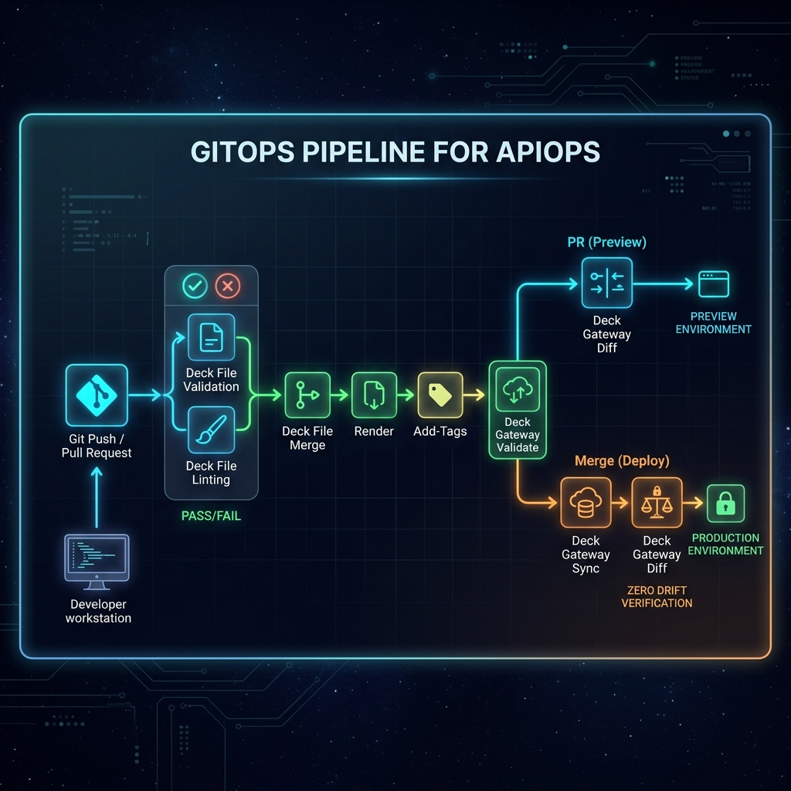

# APIOps Bootcamp - Mastering decK Commands

> **Story:** You're the platform engineer for the **Bookstore API**.
> In the previous module (API Gateway), you configured Kong one plugin at a
> time using `deck gateway apply` — rate limiting, key auth, CORS, consumers,
> the works. It was a great way to *learn* plugins, but manually applying
> seventeen YAML files is not how you run production.
>
> This module takes you from "I can configure a gateway" to "I can **operate**
> a gateway at scale." You'll work through three real-world scenarios, then
> learn the offline file toolchain that powers CI/CD pipelines.

> **Looking for the UI walkthrough?** This file is the CLI bootcamp. Several
> `deck file *` commands (lint, patch, render, merge, add-plugins, add-tags)
> are CI-time YAML transforms with no Konnect UI counterpart — but the
> *gateway-side* operations (sync, apply, dump, reset) all have UI screens
> that mirror them. See [README-UI.md](README-UI.md) for the click-by-click
> companion that covers the UI-reachable steps and explicitly names what
> stays CLI-only.

---

## What You'll Cover

| Scenario | Story | Commands You'll Learn |
|----------|-------|-----------------------|
| **1 — Discovery** | Your gateway is running from Module 1. What's on it? | `ping`, `dump` |
| **2 — Declarative Rebuild** | Rebuild the Bookstore API properly — one file, full control | `validate`, `diff`, `sync`, `apply`, `reset` |
| **3 — Migration** | A partner hands you an OpenAPI spec. Bring it into Kong. | `openapi2kong`, `add-plugins`, `merge` |
| **4 — CI/CD Toolchain** | Offline file operations for real pipelines | `file validate`, `lint`, `render`, `patch`, `add-tags` |

---

## Prerequisites

- [decK CLI](https://docs.konghq.com/deck/latest/installation/) installed
- Konnect account with a control plane (the same one from Module 1)
- Terminal open in this `apiops/` directory

```bash
export KONNECT_TOKEN="<your-konnect-pat>"
export CP_NAME="<your-control-plane-name>"
export PROXY_URL=https://<YOUR_SERVERLESS_PROXY_URL>

# Several steps write transformed YAML into ./output/. Create it once up front.
mkdir -p output
```

> **Three terms used throughout this bootcamp:**
>
> - **`_format_version: "3.0"`** at the top of every entity file is decK's
>   schema version. Quoted because YAML would otherwise parse `3.0` as a
>   float and lose the trailing zero. Transformer / patch files use the
>   older `"1.0"` schema — that's intentional, not a typo.
> - **Partial** = a YAML file that contains a *subset* of entities (just
>   services, or just plugins). decK doesn't care that a file is incomplete
>   as long as you `deck file merge` partials together before `deck gateway
>   sync`.
> - **Tag** = a free-form string attached to any entity. `select_tags` lets
>   teams co-own a control plane by syncing only the entities they've
>   tagged.

---

## File Structure

```
apiops/
├── deck/
│   ├── 01-bookstore-base.yaml        ← Base service + route (Scenario 2)
│   ├── 02-bookstore-plugins.yaml     ← + rate-limiting, correlation-id (Scenario 2)
│   ├── 03-bookstore-consumers.yaml   ← + key-auth, consumers (Scenario 2)
│   ├── 04-bookstore-tagged.yaml      ← Same service with tags (Part 4)
│   ├── 05-bookstore-templated.yaml   ← Same service with env var templates (Part 4)
│   ├── partial-services.yaml         ← Just the service (Part 4)
│   ├── partial-plugins.yaml          ← Just the plugins (Part 4)
│   ├── partial-consumers.yaml        ← Just the consumers (Part 4)
│   ├── plugin-cors.yaml              ← CORS plugin for add-plugins (Scenario 3)
│   └── patch-timeouts.json           ← JSONPath patch for timeouts (Part 4)
├── openapi/
│   └── bookstore-api.yaml            ← OpenAPI spec (Scenario 3)
├── lint/
│   └── ruleset.yaml                  ← Linting rules (Part 4)
└── README.md                         ← This file
```

---

## Command Reference

### Gateway Commands (Live Operations)

| Command | What It Does | Mutates Kong? | When to Use |
|---------|-------------|---------------|-------------|
| `deck gateway ping` | Tests connectivity | No | First step in any troubleshooting |
| `deck gateway dump` | Exports live state to YAML | No | Backup, audit, bootstrapping GitOps |
| `deck gateway diff` | Shows what would change | No | Before every sync, drift detection |
| `deck gateway sync` | Reconciles Kong to match YAML | **Yes** (deletes unmanaged entities) | Full-ownership deployments |
| `deck gateway apply` | Creates/updates, never deletes | No (additive only) | Shared environments, incremental changes |
| `deck gateway validate` | Checks YAML against live Kong | No | Pre-deployment validation |
| `deck gateway reset` | Deletes ALL entities | **Yes** (nuclear) | Clean slate, teardown |

### File Commands (Offline Operations)

| Command | What It Does | Needs Kong? | When to Use |
|---------|-------------|-------------|-------------|
| `deck file validate` | Schema and reference checks | No | CI pipeline, pre-commit |
| `deck file lint` | Custom governance rules | No | Enforce naming, tagging, standards |
| `deck file openapi2kong` | OpenAPI → Kong config | No | API-first workflows |
| `deck file merge` | Combine partial files | No | Multi-team, split configs |
| `deck file render` | Combine + resolve env vars + validate | No | Environment-specific builds |
| `deck file patch` | Modify values with JSONPath | No | Bulk updates, CI transforms |
| `deck file add-plugins` | Add plugins to config | No | Standardize plugin sets |
| `deck file add-tags` | Tag entities for scoping | No | Multi-team ownership |
| `deck file list-tags` | Show all tags in a file | No | Audit, discovery |
| `deck file remove-tags` | Remove tags from entities | No | Clean up, re-scope |

---

# Scenario 1 — Discovery: What's Running on My Gateway?

> **Story:** You just finished the API Gateway module. You configured
> `httpbun-service` with rate limiting, key auth, proxy cache, CORS,
> correlation ID, request transformers, consumers, and more — applying each
> plugin file one at a time with `deck gateway apply`.
>
> Before you start APIOps, let's take stock. Can you still reach the
> gateway? What's actually configured? If someone else touched the control
> plane while you were at lunch, would you know?
>
> This scenario introduces two read-only commands: **`ping`** (am I connected?)
> and **`dump`** (what's on the gateway right now?).

---

## Step 1 — Test Connectivity (`deck gateway ping`)

> **What it does:** Verifies that decK can reach your Kong Gateway and authenticate.
> Use this as the first troubleshooting step when anything seems wrong.

```bash
deck gateway ping \
  --konnect-token $KONNECT_TOKEN \
  --konnect-control-plane-name "$CP_NAME"
```

**Expected output:**
```
Successfully Konnected to the <Your-Org> organization!
```

**What to check if it fails:**

| Error | Cause | Fix |
|-------|-------|-----|
| `401 Unauthorized` | Bad token | Regenerate PAT in Konnect → Personal Access Tokens |
| `control plane not found` | Wrong CP name | Check exact name in Gateway Manager |
| `connection refused` | Network issue | Check internet, VPN, proxy settings |

> **Teach:** This command does NOT read or write any config. It's purely a handshake.
> Always run `ping` before `diff` or `sync` to isolate auth issues from config issues.

---

## Step 2 — Export the Live State (`deck gateway dump`)

> **What it does:** Exports the current live Kong state to YAML.
> You've been applying plugins one by one in Module 1 — now see the *combined* result
> as a single declarative file.

```bash
# Dump to stdout — see everything that's on the gateway right now
deck gateway dump \
  --konnect-token $KONNECT_TOKEN \
  --konnect-control-plane-name "$CP_NAME"
```

Scroll through the output. You'll see `httpbun-service`, its route, all the plugins
you applied in Module 1, the consumers you created — everything in one YAML document.

```bash
# Dump to a file for safekeeping
deck gateway dump -o output/live-state.yaml \
  --konnect-token $KONNECT_TOKEN \
  --konnect-control-plane-name "$CP_NAME"
```

```bash
# Dump in JSON format (useful for programmatic processing)
deck gateway dump --format json \
  --konnect-token $KONNECT_TOKEN \
  --konnect-control-plane-name "$CP_NAME"
```

**Inspect what you captured:**

```bash
cat output/live-state.yaml
```

> **Teach:** `dump` is read-only — it never changes anything on the gateway.
> This is the command that bridges "click-ops" and "GitOps":
> - **Bootstrap GitOps:** dump a manually configured Gateway into YAML, commit it to git, manage with `sync` going forward
> - **Backup:** dump before risky changes — you can always `sync` the dump file back to restore
> - **Audit:** compare live state against your repo to detect unauthorized or accidental changes
>
> The file you just dumped is a snapshot of everything from Module 1. In the
> next scenario, you'll learn to *author* these files from scratch instead
> of dumping them after the fact.

---

## Step 3 — Clean Slate

Before moving to Scenario 2, reset the gateway so you're starting fresh.
This ensures the Bookstore API you're about to build doesn't collide with
the `httpbun-service` from Module 1.

```bash
deck gateway reset \
  --konnect-token $KONNECT_TOKEN \
  --konnect-control-plane-name "$CP_NAME" \
  --force
```

**Verify it's empty:**

```bash
deck gateway dump \
  --konnect-token $KONNECT_TOKEN \
  --konnect-control-plane-name "$CP_NAME"
# → _format_version: "3.0" (empty — no entities)
```

> **Teach:** `reset` deletes **every entity** in the control plane. It requires
> `--force` and has no undo. In production, you'd almost never use it — prefer
> `sync` with your desired-state file to converge instead. Here, it's a clean
> break between modules.

---

# Scenario 2 — Declarative Rebuild: The Bookstore API from Scratch

> **Story:** In Module 1, you learned plugins by applying them one at a time.
> That's great for learning, but terrible for production. What if you need to
> recreate that setup on a new control plane? What if a teammate accidentally
> deletes a plugin? What if you need the exact same config in staging and
> production?
>
> The answer is **declarative configuration**: you write a YAML file that
> describes your *desired state*, and decK makes the gateway match it. The
> file lives in git, gets reviewed in PRs, and deploys through CI/CD.
>
> In this scenario, you'll build the Bookstore API step by step — but instead
> of applying one plugin at a time, you'll work with complete configuration
> files and learn the full lifecycle of `validate → diff → sync → apply`.

---

## Step 4 — Examine the Base Config

Before deploying anything, look at what you're about to apply:

```bash
cat deck/01-bookstore-base.yaml
```

```yaml
_format_version: "3.0"
services:
- name: bookstore-service
  url: https://httpbun.com
  retries: 3
  connect_timeout: 30000
  read_timeout: 30000
  write_timeout: 30000
  routes:
  - name: bookstore-route
    paths:
    - /bookstore
    strip_path: true
    protocols:
    - http
    - https
```

This is the simplest possible Kong config: one service pointing to a backend,
one route exposing it on `/bookstore`. Compare this to Module 1's
`01-services-and-routes.yaml` — same idea, different service name and path.

---

## Step 5 — Validate Before You Deploy (`deck gateway validate`)

> **What it does:** Sends your YAML to Kong's validation API without applying it.
> Catches plugin config errors, invalid field values, and schema mismatches.

```bash
deck gateway validate deck/01-bookstore-base.yaml \
  --konnect-token $KONNECT_TOKEN \
  --konnect-control-plane-name "$CP_NAME"
```

**Expected output:**
```
(no output = valid)
```

Now validate the file that includes plugins:

```bash
deck gateway validate deck/02-bookstore-plugins.yaml \
  --konnect-token $KONNECT_TOKEN \
  --konnect-control-plane-name "$CP_NAME"
```

**Try breaking it** — create a bad config to see the error:

```bash
cat > /tmp/bad-config.yaml << 'EOF'
_format_version: "3.0"
services:
- name: bookstore-service
  url: https://httpbun.com
  routes:
  - name: bookstore-route
    paths:
    - /bookstore
  plugins:
  - name: rate-limiting
    config:
      minute: -1
      policy: invalid-policy
EOF

deck gateway validate /tmp/bad-config.yaml \
  --konnect-token $KONNECT_TOKEN \
  --konnect-control-plane-name "$CP_NAME"
```

> **Teach:** `gateway validate` checks against the **live Kong schema** — it knows
> which plugins are available, which fields are valid, and catches errors that
> offline validation would miss. Use it in CI right before `sync` to fail fast.

---

## Step 6 — Preview Changes (`deck gateway diff`)

> **What it does:** Shows you what `sync` **would** do — without actually doing it.
> Think of it like `terraform plan` or `git diff`.

```bash
deck gateway diff deck/01-bookstore-base.yaml \
  --konnect-token $KONNECT_TOKEN \
  --konnect-control-plane-name "$CP_NAME"
```

**Expected output:**
```
creating service bookstore-service
creating route bookstore-route
Summary:
  Created: 2
  Updated: 0
  Deleted: 0
```

**Nothing changed yet!** The gateway is still empty. This is just a preview.

> **Teach:** Always run `diff` before `sync` in production. It's your safety net.
> In CI/CD pipelines, `diff` runs on pull requests to show reviewers what will
> change; `sync` runs on merge to main to actually apply it.

---

## Step 7 — Deploy the Base Service (`deck gateway sync`)

> **What it does:** Makes Kong's live state **exactly match** your YAML file.
> Creates missing entities, updates changed ones, and **deletes entities not in the file**.
>
> This is the most powerful command — it's a full reconciliation.

```bash
deck gateway sync deck/01-bookstore-base.yaml \
  --konnect-token $KONNECT_TOKEN \
  --konnect-control-plane-name "$CP_NAME"
```

**Expected output:**
```
creating service bookstore-service
creating route bookstore-route
Summary:
  Created: 2
  Updated: 0
  Deleted: 0
```

**Verify it works:**

```bash
curl -s $PROXY_URL/bookstore/get | jq .url
# → "https://httpbun.com/get"

curl -s $PROXY_URL/bookstore/headers | jq .headers.Host
# → "httpbun.com"
```

> **Teach:** `sync` = "Kong should look exactly like this YAML, nothing more,
> nothing less." If you remove an entity from your YAML and re-sync, it gets
> **deleted** from Kong. This is GitOps-style: the repo is the single source
> of truth.

---

## Step 8 — Add Plugins: sync vs apply

In Module 1, you added plugins one file at a time with `deck gateway apply`.
Now let's see *both* approaches and understand when to use which.

### Option A: `apply` (additive, safe for shared environments)

> `apply` creates or updates entities but **never deletes** anything.

```bash
deck gateway apply deck/02-bookstore-plugins.yaml \
  --konnect-token $KONNECT_TOKEN \
  --konnect-control-plane-name "$CP_NAME"
```

**Expected output:**
```
creating plugin rate-limiting for service bookstore-service
creating plugin correlation-id for service bookstore-service
creating plugin request-transformer for service bookstore-service
Summary:
  Created: 3
  Updated: 0
  Deleted: 0
```

**Verify the plugins are live:**

```bash
# Correlation ID header added
curl -i $PROXY_URL/bookstore/get 2>&1 | grep -i x-request-id
# → X-Request-ID: uuid#1

# Request transformer added custom headers
curl -s $PROXY_URL/bookstore/headers | jq '.headers["X-Api-Version"]'
# → "v1"

curl -s $PROXY_URL/bookstore/headers | jq '.headers["X-Service"]'
# → "bookstore"

# Rate limiting active
curl -i $PROXY_URL/bookstore/get 2>&1 | grep -i x-ratelimit
# → X-RateLimit-Limit-Minute: 100
```

### Option B: `sync` (full reconciliation, GitOps-style)

Now watch what happens when you sync the consumers file, which has key-auth
and rate-limiting but *not* correlation-id or request-transformer:

```bash
# Preview first — notice what gets DELETED
deck gateway diff deck/03-bookstore-consumers.yaml \
  --konnect-token $KONNECT_TOKEN \
  --konnect-control-plane-name "$CP_NAME"
```

The diff shows that correlation-id and request-transformer will be **deleted**
because they aren't in `03-bookstore-consumers.yaml`. That's `sync` being
honest — it reconciles to exactly what's in the file.

```bash
deck gateway sync deck/03-bookstore-consumers.yaml \
  --konnect-token $KONNECT_TOKEN \
  --konnect-control-plane-name "$CP_NAME"
```

**Verify:**

```bash
# No API key → 401 (key-auth is now active)
curl -i $PROXY_URL/bookstore/get

# Admin key → 200
curl -i $PROXY_URL/bookstore/get -H "apikey: admin-key-abc123"
# → X-Consumer-Username: bookstore-admin

# Reader key → 200
curl -i $PROXY_URL/bookstore/get -H "apikey: reader-key-def456"
# → X-Consumer-Username: bookstore-reader
```

### When to Use Which

| Scenario | Use | Why |
|----------|-----|-----|
| Single team owns the entire CP | `sync` | Full control, GitOps-clean |
| Multiple teams share a CP | `apply` | Won't delete another team's entities |
| CI/CD pipeline (main branch) | `sync` | Repo = source of truth |
| Quick plugin addition to prod | `apply` | Surgical, no side effects |
| Drift correction | `sync` | Forces CP back to desired state |

> **Teach:** This is a key `sync` lesson — it **deleted** the plugins from
> the `apply` step that weren't in the consumers file. In real GitOps, you
> maintain **one complete file** (or use `merge` to combine partials) so
> nothing gets accidentally removed. Module 1's one-file-per-plugin approach
> works for learning; Scenario 2's single-source-of-truth approach works
> for production.

---

## Step 9 — Drift Detection with `dump` + `diff`

> **What it does:** Capture the live state and compare it against your file.
> This is how you detect unauthorized changes — someone added a plugin through
> the UI, or another team's script modified your service.

```bash
# Capture what's actually running
deck gateway dump -o /tmp/live.yaml \
  --konnect-token $KONNECT_TOKEN \
  --konnect-control-plane-name "$CP_NAME"

# Compare it against your source-of-truth file
diff deck/03-bookstore-consumers.yaml /tmp/live.yaml
```

If the output is empty, live state matches your file — zero drift. If there
are differences, someone (or something) changed the gateway outside your
YAML-managed workflow.

```bash
# Or use deck gateway diff directly — it compares your file against live state
deck gateway diff deck/03-bookstore-consumers.yaml \
  --konnect-token $KONNECT_TOKEN \
  --konnect-control-plane-name "$CP_NAME"
```

**Expected output (no drift):**
```
Summary:
  Created: 0
  Updated: 0
  Deleted: 0
```

> **Teach:** In production, run `deck gateway diff` on a schedule (cron job
> or CI). If it reports changes, someone modified the gateway outside your
> GitOps pipeline — and you should investigate.

---

## Step 10 — Reset Before Next Scenario

Clean up the Bookstore API so Scenario 3 starts fresh:

```bash
deck gateway reset \
  --konnect-token $KONNECT_TOKEN \
  --konnect-control-plane-name "$CP_NAME" \
  --force
```

> **Teach:** `reset` is rarely used in production. It's for:
> - Tearing down a demo or test control plane
> - Starting over after a botched migration
> - Cleaning up before a fresh `sync` in CI
>
> In real workflows, prefer `sync` with your desired-state file over `reset`.

---

# Scenario 3 — Migration: Bringing an External API into Kong

> **Story:** The Bookstore company just acquired a smaller publisher that
> runs their own book catalog, author directory, and review system. They
> hand you an **OpenAPI specification** — that's all you get. No Kong config,
> no gateway setup, just a spec.
>
> Your job: bring their API into Kong. Generate the gateway config from the
> spec, layer on your organization's standard plugins (CORS, rate limiting),
> merge it with consumer definitions, and deploy.
>
> This scenario mirrors a real migration: you start with a spec (or dump
> from another API gateway), transform it into Kong config using `deck file`
> commands, and sync it to your control plane.

---

## Step 11 — Convert OpenAPI to Kong Config (`deck file openapi2kong`)

> **What it does:** Generates Kong Gateway config (services, routes) from an
> OpenAPI spec. This is the **API-first** workflow — start with a spec,
> auto-generate the gateway layer.

First, inspect the spec you received:

```bash
cat openapi/bookstore-api.yaml
```

The spec defines a Bookstore API with endpoints for `/books`, `/books/{bookId}`,
`/authors`, `/authors/{authorId}`, and `/reviews`. The backend URL is in the
`servers` block.

**Generate the Kong config:**

```bash
deck file openapi2kong \
  --spec openapi/bookstore-api.yaml \
  --output-file output/from-openapi.yaml
```

**Inspect the generated config:**

```bash
cat output/from-openapi.yaml
```

You'll see Kong services and routes auto-generated from the OpenAPI paths:
- `/books` → route with GET, POST
- `/books/{bookId}` → route with GET, PUT, DELETE
- `/authors` → route with GET
- `/authors/{authorId}` → route with GET
- `/reviews` → route with GET, POST

The upstream URL comes from the `servers` block in the OpenAPI spec.

**Validate the generated config:**

```bash
deck file validate output/from-openapi.yaml
```

> **Teach:** API-first means the OpenAPI spec is the source of truth.
> Developers define the API contract, `openapi2kong` generates the gateway
> layer. You don't hand-write services and routes — you derive them.

---

## Step 12 — Add Standard Plugins (`deck file add-plugins`)

> **What it does:** Adds plugin configurations to an existing YAML file.
> Your platform team mandates CORS on every service. Instead of editing
> the YAML by hand, inject it automatically.

```bash
# Look at the plugin template
cat deck/plugin-cors.yaml
```

The plugin-cors file uses a `selector` to target all services and adds a
CORS plugin with your org's standard allowed origins and methods.

```bash
# Add CORS to the generated config
deck file add-plugins \
  -s output/from-openapi.yaml \
  deck/plugin-cors.yaml \
  --output-file output/migrated-with-cors.yaml
```

**Inspect the result:**

```bash
cat output/migrated-with-cors.yaml
# → The service now has a CORS plugin attached
```

> **Teach:** `add-plugins` is the bridge between API-first and platform
> standards. API teams define specs; the platform team adds security,
> observability, and traffic plugins automatically in CI — no manual YAML
> editing needed. You could chain multiple `add-plugins` calls to layer on
> rate-limiting, correlation-id, and other standard plugins.

---

## Step 13 — Merge with Consumer Definitions (`deck file merge`)

> **What it does:** Merges multiple partial YAML files into one complete config.
> The migrated API needs consumers (API keys) — those live in a separate file
> maintained by the API consumers team.

```bash
deck file merge \
  output/migrated-with-cors.yaml \
  deck/partial-consumers.yaml \
  --output-file output/migration-final.yaml
```

**Inspect the merged result:**

```bash
cat output/migration-final.yaml
```

You'll see the complete config: service + routes (from the OpenAPI spec),
CORS plugin (from the platform team), and consumers with API keys (from the
consumers team).

**Validate the final artifact:**

```bash
deck file validate output/migration-final.yaml
```

> **Teach:** Merge enables a split-by-concern file layout:
> - API team owns the OpenAPI spec → generates the service + routes
> - Platform team owns the plugin templates → injected via `add-plugins`
> - Consumer team owns the API keys → merged in via `merge`
>
> Each team manages their file independently. CI combines them before `sync`.

---

## Step 14 — Deploy the Migrated API

Now bring it all together — validate against the live gateway, preview the
diff, and sync:

```bash
# Validate against live Kong
deck gateway validate output/migration-final.yaml \
  --konnect-token $KONNECT_TOKEN \
  --konnect-control-plane-name "$CP_NAME"
```

```bash
# Preview what will be created
deck gateway diff output/migration-final.yaml \
  --konnect-token $KONNECT_TOKEN \
  --konnect-control-plane-name "$CP_NAME"
```

```bash
# Deploy
deck gateway sync output/migration-final.yaml \
  --konnect-token $KONNECT_TOKEN \
  --konnect-control-plane-name "$CP_NAME"
```

**Verify the migration:**

```bash
# The migrated API is live
curl -s $PROXY_URL/books | jq .
curl -s $PROXY_URL/authors | jq .

# CORS headers are present (platform standard)
curl -i -X OPTIONS $PROXY_URL/books \
  -H "Origin: https://bookstore.example.com" \
  -H "Access-Control-Request-Method: GET" 2>&1 | grep -i access-control
```

> **Teach:** The migration workflow is:
> `OpenAPI spec → openapi2kong → add-plugins → merge → validate → diff → sync`
>
> This is the same pipeline whether you're migrating from another gateway
> (AWS API Gateway, Apigee, etc.) or onboarding a brand-new API. As long as
> you have an OpenAPI spec, you can generate the Kong config automatically.

---

## Step 15 — Reset Before Part 4

```bash
deck gateway reset \
  --konnect-token $KONNECT_TOKEN \
  --konnect-control-plane-name "$CP_NAME" \
  --force
```

---

# Part 4 — File Operations: The CI/CD Toolchain

> **Story:** You now know the gateway commands that talk to live Kong. But
> half the APIOps story happens *before* anything touches the gateway —
> in your CI pipeline, on your laptop, in a pull-request check.
>
> These `deck file` commands work **without a live Kong Gateway**. They
> validate, lint, transform, and prepare YAML files locally. By the time
> you run `deck gateway sync`, the config has already been validated,
> linted, merged, rendered, patched, tagged, and tested — offline.

---

## Step 16 — Offline Schema Validation (`deck file validate`)

> **What it does:** Checks YAML structure and schema offline — no Kong connection needed.
> Catches syntax errors, missing required fields, and malformed configs.

```bash
# Validate the base file
deck file validate deck/01-bookstore-base.yaml
```

```bash
# Validate the consumers file
deck file validate deck/03-bookstore-consumers.yaml
```

**Try breaking it:**

```bash
cat > /tmp/broken.yaml << 'EOF'
_format_version: "3.0"
services:
- name: bookstore-service
  url: https://httpbun.com
  invalid_field: true
  routes:
  - name: bookstore-route
    paths: not-a-list
EOF

deck file validate /tmp/broken.yaml
```

> **Teach:** `file validate` is fast and offline — use it in pre-commit hooks
> and CI. It catches structural errors but can't validate plugin-specific
> configs (that requires `gateway validate` with a live connection).

### `file validate` vs `gateway validate`

| Check | `file validate` | `gateway validate` |
|-------|----------------|-------------------|
| YAML syntax | ✅ | ✅ |
| Schema structure | ✅ | ✅ |
| Plugin config values | ❌ | ✅ |
| Plugin availability | ❌ | ✅ |
| Version-specific fields | ❌ | ✅ |
| Needs Kong? | No | Yes |
| Speed | Fast | Slower (network) |

---

## Step 17 — Lint Against Rules (`deck file lint`)

> **What it does:** Runs custom governance rules against your YAML.
> Enforce naming conventions, required tags, timeout policies — whatever
> your team decides.

```bash
# Lint the base file (no tags → will fail!)
deck file lint \
  -s deck/01-bookstore-base.yaml \
  lint/ruleset.yaml
```

**Expected:** Errors about missing tags (the base file has no tags).

```bash
# Lint the tagged file (has tags → should pass)
deck file lint \
  -s deck/04-bookstore-tagged.yaml \
  lint/ruleset.yaml
```

**Expected:** Clean pass (all entities have tags, names are kebab-case).

**Review the ruleset:**

```bash
cat lint/ruleset.yaml
```

The ruleset enforces:
- ❌ `no-untagged-services` — every service must have tags
- ⚠️ `no-untagged-routes` — routes should have tags
- ❌ `service-name-convention` — kebab-case names only
- ❌ `route-name-convention` — kebab-case names only
- ⚠️ `service-timeouts` — explicit timeout config recommended
- ⚠️ `service-retries` — explicit retry config recommended

> **Teach:** Linting is how platform teams enforce standards at scale.
> Put `deck file lint` in your CI pipeline to block PRs that don't follow
> conventions. Write rules for what matters to your org: naming, tagging,
> timeout policies, etc.

---

## Step 18 — Combine Partial Files (`deck file merge`)

> **What it does:** Merges multiple partial YAML files into one complete config.
> This is how teams split ownership — one file per concern, combined at deploy time.

```bash
deck file merge \
  deck/partial-services.yaml \
  deck/partial-plugins.yaml \
  deck/partial-consumers.yaml \
  --output-file output/merged.yaml
```

**Inspect the result:**

```bash
cat output/merged.yaml
```

You'll see all three files combined:
- `bookstore-service` with its route (from partial-services)
- `rate-limiting`, `key-auth`, `correlation-id` plugins (from partial-plugins)
- `bookstore-admin`, `bookstore-reader`, `bookstore-guest` consumers (from partial-consumers)

**Validate the merged output:**

```bash
deck file validate output/merged.yaml
```

**You can even sync the merged output directly:**

```bash
# Preview first
deck gateway diff output/merged.yaml \
  --konnect-token $KONNECT_TOKEN \
  --konnect-control-plane-name "$CP_NAME"
```

> **Teach:** Merge enables a split-by-concern file layout:
> - `services.yaml` — owned by the platform team
> - `plugins.yaml` — owned by the security team
> - `consumers.yaml` — owned by the API consumers team
>
> Each team manages their file independently. CI merges them before `sync`.

---

## Step 19 — Resolve Environment Variables (`deck file render`)

> **What it does:** Takes a templated YAML file with `${{ env "VAR" }}` placeholders,
> resolves them against your shell environment, and outputs a concrete YAML file.
> Use `--populate-env-vars` to substitute real values; without it, deck mocks them.

```bash
# First, look at the template
cat deck/05-bookstore-templated.yaml
# → You'll see ${{ env "DECK_UPSTREAM_URL" }}, ${{ env "DECK_ENV" }}, etc.
```

```bash
# Render for dev (set env vars, then render)
DECK_ENV=dev \
DECK_UPSTREAM_URL=https://httpbun.com \
DECK_RATE_LIMIT=60 \
DECK_CONNECT_TIMEOUT=30000 \
DECK_READ_TIMEOUT=30000 \
DECK_WRITE_TIMEOUT=30000 \
deck file render deck/05-bookstore-templated.yaml \
  --populate-env-vars \
  --output-file output/rendered-dev.yaml

cat output/rendered-dev.yaml
# → url: https://httpbun.com, minute: 60, env:dev
```

```bash
# Render for staging (different values)
DECK_ENV=staging \
DECK_UPSTREAM_URL=https://httpbun.com \
DECK_RATE_LIMIT=200 \
DECK_CONNECT_TIMEOUT=60000 \
DECK_READ_TIMEOUT=60000 \
DECK_WRITE_TIMEOUT=60000 \
deck file render deck/05-bookstore-templated.yaml \
  --populate-env-vars \
  --output-file output/rendered-staging.yaml

cat output/rendered-staging.yaml
# → url: https://httpbun.com, minute: 200, env:staging
```

**Compare dev vs staging:**

```bash
diff output/rendered-dev.yaml output/rendered-staging.yaml
```

> **Teach:** Templating lets you use **one YAML file** across all environments.
> The template lives in the repo; environment-specific values come from CI
> variables, Vault, or deployment configs. No more copying files per environment.
>
> Without `--populate-env-vars`, deck substitutes mock placeholder values —
> useful for previewing structure without real config.

---

## Step 20 — Patch Values (`deck file patch`)

> **What it does:** Modifies specific values in a YAML file using JSONPath selectors.
> Great for bulk updates without editing YAML by hand.

```bash
# Look at the patch file
cat deck/patch-timeouts.json
```

The patch changes all services to:
- `retries: 5` (was 3)
- `connect_timeout: 60000` (was 30000)
- `read_timeout: 60000` (was 30000)
- `write_timeout: 60000` (was 30000)

```bash
# Apply the patch to the base file (inline selector + value)
deck file patch \
  -s deck/01-bookstore-base.yaml \
  --selector '$..services[*]' \
  --value 'retries:5' \
  --output-file output/patched.yaml
```

**Or use a patch file with multiple operations:**

```bash
deck file patch \
  -s deck/01-bookstore-base.yaml \
  deck/patch-timeouts.json \
  --output-file output/patched.yaml
```

**Compare before and after:**

```bash
diff deck/01-bookstore-base.yaml output/patched.yaml
# → retries: 3 → 5, timeouts: 30000 → 60000
```

> **Teach:** Patches are powerful for CI workflows:
> - Bump all timeouts before deploying to a slow environment
> - Override URLs for a canary deployment
> - Apply org-wide policy changes across many files

---

## Step 21 — Tag Entities (`deck file add-tags`)

> **What it does:** Adds tags to all entities in a YAML file.
> Tags are how decK scopes ownership — `select_tags` lets each team sync
> only their entities without stepping on each other.

```bash
# Add team and environment tags to the base file
deck file add-tags \
  deck/01-bookstore-base.yaml \
  team:bookstore \
  env:staging \
  --output-file output/tagged.yaml
```

**Or add multiple tags at once:**

```bash
deck file add-tags \
  deck/01-bookstore-base.yaml \
  team:bookstore env:production \
  --output-file output/tagged-all.yaml
```

**Verify tags were added:**

```bash
deck file list-tags output/tagged-all.yaml
```

> **Teach:** Tags enable multi-team ownership of a shared control plane:
> ```bash
> # Team A syncs only their entities
> deck gateway sync team-a-config.yaml --select-tag team:payments
>
> # Team B syncs only their entities
> deck gateway sync team-b-config.yaml --select-tag team:orders
> ```
> Without tags, `sync` would delete the other team's entities.

---

## Step 22 — List Tags (`deck file list-tags`)

> **What it does:** Shows all tags used in a YAML file. Useful for auditing
> and discovery.

```bash
# List tags in the tagged file
deck file list-tags deck/04-bookstore-tagged.yaml
```

**Expected output:**
```
team:bookstore
env:staging
```

```bash
# List tags in the consumers file (no tags → empty)
deck file list-tags deck/03-bookstore-consumers.yaml
```

> **Teach:** Use `list-tags` to audit tag coverage before enabling `select_tags`
> scoping. If entities are missing tags, they'll be invisible to scoped syncs —
> and could get deleted by another team's `sync`.

---

## Step 23 — Remove Tags (`deck file remove-tags`)

> **What it does:** Removes specific tags from entities. Use when re-scoping
> ownership or promoting across environments.

```bash
# Remove the staging tag
deck file remove-tags \
  deck/04-bookstore-tagged.yaml \
  env:staging \
  --output-file output/untagged.yaml
```

**Verify:**

```bash
deck file list-tags output/untagged.yaml
# → team:bookstore (env:staging is gone)
```

```bash
# Remove ALL tags
deck file remove-tags \
  deck/04-bookstore-tagged.yaml \
  team:bookstore env:staging \
  --output-file output/no-tags.yaml

deck file list-tags output/no-tags.yaml
# → (empty)
```

> **Teach:** Tag lifecycle matters:
> - Migrating a service from team A to team B? Remove old tags, add new ones.
> - Promoting from staging to production? Swap `env:staging` for `env:production`.

---

# Putting It All Together: A GitOps Pipeline

Here's how the commands from all three scenarios chain together in a real
CI/CD pipeline:



```
Discovery:    ping → dump (what's running?)
Declarative:  validate → diff → sync/apply (deploy from YAML)
Migration:    openapi2kong → add-plugins → merge (build the config)
CI Pipeline:  file validate → lint → merge → render → patch → add-tags → gateway validate → diff → sync
```

### Example CI Script

```bash
#!/bin/bash
set -euo pipefail

# 1. Validate offline (fast, no network)
deck file validate deck/*.yaml
for f in deck/*.yaml; do deck file lint -s "$f" lint/ruleset.yaml; done

# 2. Build deployment artifact
deck file merge deck/partial-*.yaml --output-file /tmp/merged.yaml
deck file render /tmp/merged.yaml --populate-env-vars --output-file /tmp/rendered.yaml
deck file add-tags /tmp/rendered.yaml team:bookstore env:$ENVIRONMENT \
  --output-file /tmp/final.yaml

# 3. Validate against live Kong (catches plugin/version mismatches)
deck gateway ping --konnect-token $KONNECT_TOKEN --konnect-control-plane-name $CP_NAME
deck gateway validate /tmp/final.yaml \
  --konnect-token $KONNECT_TOKEN --konnect-control-plane-name $CP_NAME

# 4. Deploy (or preview)
if [ "$CI_BRANCH" = "main" ]; then
  deck gateway sync /tmp/final.yaml \
    --konnect-token $KONNECT_TOKEN --konnect-control-plane-name $CP_NAME

  # 5. Verify zero drift
  deck gateway diff /tmp/final.yaml \
    --konnect-token $KONNECT_TOKEN --konnect-control-plane-name $CP_NAME
else
  # PR branch — preview only
  deck gateway diff /tmp/final.yaml \
    --konnect-token $KONNECT_TOKEN --konnect-control-plane-name $CP_NAME
fi
```

---

## Clean Up

```bash
# Reset Kong to empty
deck gateway reset \
  --konnect-token $KONNECT_TOKEN \
  --konnect-control-plane-name "$CP_NAME" \
  --force

# Clean generated output files
rm -f output/*

# Clean temp files created during the bootcamp (some may not exist —
# the -f flag silences "no such file" messages).
rm -f /tmp/bad-config.yaml \
      /tmp/broken.yaml \
      /tmp/live.yaml \
      /tmp/from-spec.yaml \
      /tmp/merged.yaml \
      /tmp/rendered.yaml \
      /tmp/final.yaml
```

**What gets cleaned:**

| Source | Files | Created In |
|--------|-------|-----------|
| `output/` | `live-state.yaml`, `from-openapi.yaml`, `migrated-with-cors.yaml`, `migration-final.yaml`, `merged.yaml`, `rendered-dev.yaml`, `rendered-staging.yaml`, `patched.yaml`, `tagged.yaml`, `tagged-all.yaml`, `untagged.yaml`, `no-tags.yaml` | Scenarios 1-3, Part 4 |
| `/tmp/` | `bad-config.yaml`, `broken.yaml`, `live.yaml`, `from-spec.yaml`, `merged.yaml`, `rendered.yaml`, `final.yaml` | Steps 5, 9, 16, CI script |

---

## Quick Reference Card

```
GATEWAY (live):   ping → validate → diff → sync/apply → dump → reset
FILE (offline):   validate → lint → openapi2kong → merge → render → patch → add-plugins → add/list/remove-tags
```

| Want to... | Run |
|-----------|-----|
| Check if decK can reach Kong | `deck gateway ping` |
| See what would change | `deck gateway diff <file>` |
| Deploy (full ownership) | `deck gateway sync <file>` |
| Deploy (shared CP, additive) | `deck gateway apply <file>` |
| Backup live state | `deck gateway dump -o backup.yaml` |
| Check YAML syntax (offline) | `deck file validate <file>` |
| Enforce standards | `deck file lint -s <file> rules.yaml` |
| Generate from OpenAPI | `deck file openapi2kong --spec spec.yaml -o out.yaml` |
| Combine team files | `deck file merge a.yaml b.yaml -o combined.yaml` |
| Resolve env vars | `deck file render template.yaml --populate-env-vars -o resolved.yaml` |
| Bulk-update values | `deck file patch -s <file> patch.json -o out.yaml` |
| Add standard plugins | `deck file add-plugins -s <file> plugins.yaml -o out.yaml` |
| Tag for scoping | `deck file add-tags <file> team:X env:Y -o out.yaml` |
| Audit tags | `deck file list-tags <file>` |
| Remove tags | `deck file remove-tags <file> env:old -o out.yaml` |
| Delete everything | `deck gateway reset --force` |
