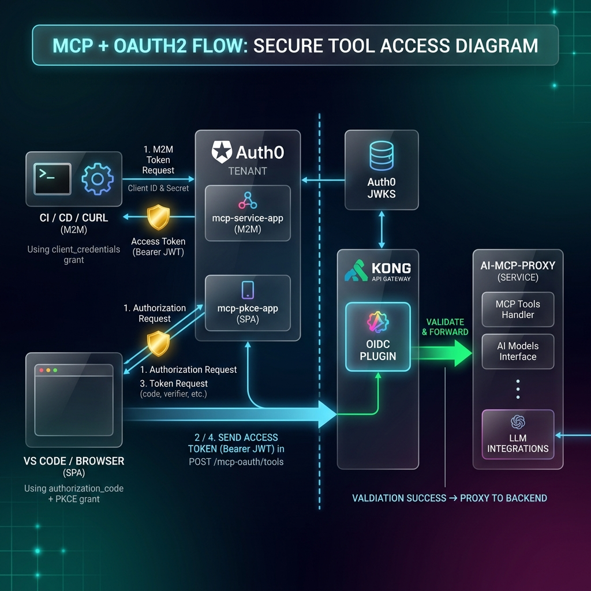

# Agentic AI Bootcamp - MCP & A2A with Kong Gateway

> **Deployment:** Konnect Control Plane + Konnect Serverless Data Plane
>
> 7-step hands-on lab using declarative `deck gateway` commands.
> Each step syncs a self-contained YAML file that **replaces** the
> previous gateway state. Steps are independent - test each step
> before moving to the next.

> **What you bring forward from the previous modules:** Kong's job in MCP
> and A2A is the *same* job it had in api-gateway - route, authenticate,
> rate-limit, observe. There is no "agent gateway"; there are standard
> gateway plugins (`key-auth`, `rate-limiting`) paired with two MCP-aware
> plugins (`ai-mcp-proxy`, `ai-mcp-oauth2`). If you understood Step 05 of
> api-gateway, you already understand Step 2 here. Read the **Concepts**
> section below for the four new ideas (MCP, listener modes, PKCE, A2A)
> before touching any YAML.

---

## Concepts - Read This First

This bootcamp introduces four ideas that aren't covered in the earlier
api-gateway / apiops / ai-gateway modules. Skim these definitions before
touching any YAML.

### MCP (Model Context Protocol)

MCP is the open protocol AI assistants (Claude Desktop, GitHub Copilot,
Cursor) use to discover and call **tools** - small, well-described functions
the LLM can invoke. Instead of every assistant inventing its own plugin
format, MCP standardises:

- A wire format (JSON-RPC 2.0 over HTTP or stdio).
- A handshake (`initialize`) that returns the server's capabilities.
- A tool catalog (`tools/list`) and a way to invoke one (`tools/call`).
- Optional `resources/*` and `prompts/*` methods for non-tool capabilities.

A request to an MCP server looks like a plain HTTP POST whose body is a
JSON-RPC envelope:

```json
{"jsonrpc":"2.0","id":1,"method":"tools/list","params":{}}
```

The server replies with `{"jsonrpc":"2.0","id":1,"result":{"tools":[...]}}`.

### Kong's four MCP listener modes

Kong's `ai-mcp-proxy` plugin can stand in front of MCP traffic in four
shapes. Pick one per route:

| Mode | Client sends | Kong forwards as | Use when |
|---|---|---|---|
| `passthrough-listener` | MCP JSON-RPC | MCP JSON-RPC (unchanged) | Upstream is already an MCP server. |
| `conversion-listener` | MCP JSON-RPC | REST HTTP | You have a REST API and want it usable from MCP clients. |
| `conversion-only` | - (no listener) | - (just declares tools) | Per-team REST APIs that will be aggregated elsewhere. |
| `listener` (aggregate) | MCP JSON-RPC | Multiple upstreams via tagged `conversion-only` plugins | Multi-team catalog: one MCP endpoint, many backends. |

Steps 1–4 walk through each in turn. Steps 5–6 layer auth on top.

### PKCE (Proof Key for Code Exchange)

OAuth2's "authorization code" flow normally pairs a code with a client
**secret** during token exchange. That's fine for a backend, fatal for a
desktop app: the binary ships to laptops, anyone can extract the secret.

PKCE replaces the static secret with a one-time, per-request proof:

1. The client generates a random `code_verifier` (43–128 chars).
2. Hashes it (`code_challenge = SHA256(code_verifier)`).
3. Sends the **challenge** with the authorization request.
4. Gets back an auth `code` and exchanges it together with the **verifier**.

The IdP recomputes the hash and only issues a token if the values match.
The verifier never travels with the code, so intercepting either alone is
useless. Step 5's "Flow B" runs this by hand with `openssl` so you can see
each piece.

### A2A (Agent-to-Agent)

A2A is the emerging convention for **agents calling other agents**. An
orchestrator agent doesn't pick one model and shell out - it routes work to
specialised sub-agents (a flights agent, a hotels agent, a weather agent)
and merges their answers. The wire format mirrors MCP enough that JSON-RPC
clients can talk to it, with one addition: an **Agent Card** served from
`/.well-known/agent.json` that advertises which skills the agent owns and
how to reach them.

Kong's role in A2A is exactly its role in any API: route, authenticate,
rate-limit, observe. No special A2A plugin - Step 6 wires up sub-agents
using the standard `key-auth` and `rate-limiting` plugins you've already
seen in api-gateway.

### How the auth story progresses

The six steps escalate auth deliberately:

| Step | Auth on the route | Why |
|---|---|---|
| 1 | None | First, prove the protocol works. |
| 2 | `key-auth` + `rate-limiting` | Server-to-server callers; same model as api-gateway Step 05. |
| 3 | None | Focus on REST→MCP conversion, not auth. |
| 4 | None | Focus on multi-team aggregation, not auth. |
| 5 | `ai-mcp-oauth2` (JWT bearer) | Real MCP clients (VS Code, Claude Desktop) - `client_credentials` for backends, PKCE for desktops. |
| 6 | Per-sub-agent (key-auth on some, open on others) | Trust isolation between sibling agents. |

Each step's "Why this auth?" callout assumes you've read the table above.

---

## Prerequisites

```bash
export KONNECT_TOKEN="<your-konnect-pat>"
export CP_NAME="<your-control-plane-name>"
export PROXY_URL="<your-serverless-proxy-url>"   # e.g. https://abc123.kong-proxy.com
```

### Auth0 Tenant (Step 5 only)

Step 5 (OAuth2/PKCE) requires an Auth0 tenant. Set up the following:

1. **Machine-to-Machine Application** (for `client_credentials` flow)
   - Note the **Client ID** and **Client Secret**
2. **Single Page Application** with PKCE enabled (for `authorization_code` flow)
   - Set **Allowed Callback URLs** to: `$PROXY_URL/mcp-oauth/callback`
   - Note the **Client ID**
3. **API** (audience) for token validation
4. **Test users** (optional, for PKCE flow):
   - `agent-user@bootcamp.dev` / `Agent123!`

```bash
export AUTH0_DOMAIN="<your-tenant>.us.auth0.com"
```

### Docker Services + ngrok

The MCP backend runs locally in Docker. The Konnect Serverless DP cannot
reach Docker services directly, so you need **ngrok** to create public
tunnels.

```bash
cd 05-mcp-a2a
docker compose up -d --build          # MCP backend (travel tools)
```

Expose the MCP backend via ngrok:

```bash
ngrok http 3001
# → Forwarding  https://abc123.ngrok-free.app -> http://localhost:3001
```

Copy the ngrok HTTPS URL and set it:

```bash
export MCP_BACKEND_URL="abc123.ngrok-free.app"   # hostname only, no https://
```

> **Steps 3-4** use httpbun.com (external) -- no ngrok needed.
>
> **Step 7** requires additional ngrok tunnels for the MCP demo server and
> OPA guardrail service. See the Step 7 section for details.

### Verify

```bash
curl -s http://localhost:3001/health | jq '.'                        # MCP Backend (local)
curl -s https://$MCP_BACKEND_URL/health | jq '.'                    # MCP Backend (via ngrok)
deck gateway ping --konnect-token "$KONNECT_TOKEN" \
  --konnect-control-plane-name "$CP_NAME"                            # decK → Konnect
```

### Reset Gateway

Clear any existing configuration so you start from a clean slate:

```bash
deck gateway reset --force \
  --konnect-token "$KONNECT_TOKEN" \
  --konnect-control-plane-name "$CP_NAME"
```

---

## Step 1 - MCP Passthrough Listener

Client sends native MCP JSON-RPC → Kong forwards it unchanged → MCP backend processes it.

### 1.1 Sync

Replace `<MCP_BACKEND_URL>` in `deck/01-mcp-passthrough.yaml` with your ngrok URL (e.g. `abc123.ngrok-free.app`), then sync:

```bash
deck gateway sync deck/01-mcp-passthrough.yaml \
  --konnect-token "$KONNECT_TOKEN" \
  --konnect-control-plane-name "$CP_NAME"
```

### 1.2 Test - List tools

```bash
curl -s -X POST $PROXY_URL/mcp/tools \
  -H "Content-Type: application/json" \
  -H "Accept: application/json, text/event-stream" \
  -d '{"jsonrpc":"2.0","id":1,"method":"tools/list","params":{}}' \
  | jq '[.result.tools[].name]'
```

**Expected:** `["search_flights","book_flight","get_weather","search_hotels","book_hotel"]`

### 1.3 Test - Call a tool

```bash
curl -s -X POST $PROXY_URL/mcp/tools \
  -H "Content-Type: application/json" \
  -H "Accept: application/json, text/event-stream" \
  -d '{
    "jsonrpc":"2.0","id":2,
    "method":"tools/call",
    "params":{"name":"search_flights","arguments":{"origin":"SFO","destination":"LHR"}}
  }' | jq '.result.content[0].text | fromjson | .[0]'
```

**Expected:** Flight object with `airline`, `price`, `departure` fields.

---

## Step 2 - Key-Auth + Rate-Limiting

Protect the passthrough route with API key authentication and a 30 req/min rate limit.

### 2.1 Sync

Replace `<MCP_BACKEND_URL>` in `deck/02-passthrough-auth.yaml` with your ngrok URL, then sync:

```bash
deck gateway sync deck/02-passthrough-auth.yaml \
  --konnect-token "$KONNECT_TOKEN" \
  --konnect-control-plane-name "$CP_NAME"
```

### 2.2 Test - No key → 401

```bash
curl -si -X POST $PROXY_URL/mcp/tools \
  -H "Content-Type: application/json" \
  -H "Accept: application/json, text/event-stream" \
  -d '{"jsonrpc":"2.0","id":1,"method":"tools/list","params":{}}' | head -1
```

**Expected:** `HTTP/1.1 401 Unauthorized`

### 2.3 Test - With key → 200 + rate-limit headers

```bash
curl -si -X POST $PROXY_URL/mcp/tools \
  -H "X-API-Key: mcp-key-001" \
  -H "Content-Type: application/json" \
  -H "Accept: application/json, text/event-stream" \
  -d '{"jsonrpc":"2.0","id":1,"method":"tools/list","params":{}}' \
  | grep -iE "^HTTP|x-ratelimit"
```

**Expected:**
```
HTTP/1.1 200 OK
X-RateLimit-Limit-Minute: 30
X-RateLimit-Remaining-Minute: 29
```

---

## Step 3 - Conversion Listener (REST → MCP)

Expose a plain REST API (httpbun) as MCP tools. Kong converts MCP JSON-RPC tool calls into standard HTTP requests - no changes to the backend required.

> **Note:** This step uses httpbun instead of the travel backend to demonstrate
> that conversion mode works with *any* existing REST API, not just MCP-aware services.

### 3.1 Sync

```bash
deck gateway sync deck/03-conversion-listener.yaml \
  --konnect-token "$KONNECT_TOKEN" \
  --konnect-control-plane-name "$CP_NAME"
```

> **Note:** This file includes `httpbun-service` + `httpbun-route` as prerequisites. If these already exist in your CP from another lab, decK merges them.

### 3.2 Test - Initialize session

Conversion mode uses MCP Streamable HTTP (SSE). Initialize a session first:

```bash
SESSION_ID=$(curl -si -X POST $PROXY_URL/mcp/convert \
  -H "Content-Type: application/json" \
  -H "Accept: application/json, text/event-stream" \
  -d '{"jsonrpc":"2.0","id":1,"method":"initialize","params":{"protocolVersion":"2025-03-26","capabilities":{},"clientInfo":{"name":"test","version":"1.0"}}}' \
  2>&1 | grep -i "mcp-session-id" | awk '{print $2}' | tr -d '\r')
echo "Session: $SESSION_ID"
```

### 3.3 Test - List converted tools

```bash
curl -s -X POST $PROXY_URL/mcp/convert \
  -H "Content-Type: application/json" \
  -H "Accept: application/json, text/event-stream" \
  -H "mcp-session-id: $SESSION_ID" \
  -d '{"jsonrpc":"2.0","id":2,"method":"tools/list","params":{}}' \
  | grep "^data:" | sed 's/^data: //' | jq '[.result.tools[].name]'
```

**Expected:** `["check_status","echo_anything","get_headers","get_ip","get_user_agent"]`

### 3.4 Test - Call get_ip (Kong converts to GET /httpbun/ip)

```bash
curl -s -X POST $PROXY_URL/mcp/convert \
  -H "Content-Type: application/json" \
  -H "Accept: application/json, text/event-stream" \
  -H "mcp-session-id: $SESSION_ID" \
  -d '{"jsonrpc":"2.0","id":3,"method":"tools/call","params":{"name":"get_ip","arguments":{}}}' \
  | grep "^data:" | sed 's/^data: //' | jq '.result.content[0].text'
```

**Expected:** JSON string containing `"origin": "<your-ip>"`

### 3.5 Test - Call echo_anything (Kong converts to POST /httpbun/anything)

```bash
curl -s -X POST $PROXY_URL/mcp/convert \
  -H "Content-Type: application/json" \
  -H "Accept: application/json, text/event-stream" \
  -H "mcp-session-id: $SESSION_ID" \
  -d '{"jsonrpc":"2.0","id":4,"method":"tools/call","params":{"name":"echo_anything","arguments":{"body":{"message":"Hello from MCP!"}}}}' \
  | grep "^data:" | sed 's/^data: //' | jq '.result.content[0].text | fromjson | .json'
```

**Expected:** `{"message": "Hello from MCP!"}`

---

## Step 4 - Multi-Team Aggregation

Three teams each own different tools. One aggregate endpoint merges them all. `conversion-only` plugins register tools (tagged `mcp-agg`), and a `listener` plugin discovers them.

> **Why httpbun?** Steps 3-4 demonstrate how Kong converts *any* REST API into MCP tools.
> The travel backend from steps 1-2 already speaks MCP natively - here we show Kong
> making a plain REST API (httpbun) available to MCP clients without any code changes.

```
              /mcp/aggregate (listener, discovers tag: mcp-agg)
              ├── /mcp/team-alpha   (conversion-only: get_ip, get_headers)
              ├── /mcp/team-beta    (conversion-only: get_user_agent, echo_anything)
              └── /mcp/team-gamma   (conversion-only: check_status)
```

### 4.1 Sync

```bash
deck gateway sync deck/04-aggregation.yaml \
  --konnect-token "$KONNECT_TOKEN" \
  --konnect-control-plane-name "$CP_NAME"
```

### 4.2 Test - Initialize + list all tools

```bash
# Initialize
INIT_RAW=$(curl -si -X POST $PROXY_URL/mcp/aggregate \
  -H "Content-Type: application/json" \
  -H "Accept: application/json, text/event-stream" \
  -d '{"jsonrpc":"2.0","id":0,"method":"initialize","params":{"protocolVersion":"2025-03-26","capabilities":{},"clientInfo":{"name":"test","version":"1.0"}}}' 2>&1)

AGG_SESSION=$(echo "$INIT_RAW" | grep -i "mcp-session-id" | tr -d '\r' | awk '{print $2}')
echo "Session: $AGG_SESSION"

# List all tools from all 3 teams
curl -s -X POST $PROXY_URL/mcp/aggregate \
  -H "Content-Type: application/json" \
  -H "Accept: application/json, text/event-stream" \
  -H "mcp-session-id: ${AGG_SESSION}" \
  -d '{"jsonrpc":"2.0","id":1,"method":"tools/list","params":{}}' \
  | grep "^data:" | sed 's/^data: //' | jq '[.result.tools[].name]'
```

**Expected:** `["check_status","echo_anything","get_headers","get_ip","get_user_agent"]` - all 5 tools from 3 teams.

### 4.3 Test - Call tools from different teams

```bash
# get_ip (from team-alpha)
curl -s -X POST $PROXY_URL/mcp/aggregate \
  -H "Content-Type: application/json" \
  -H "Accept: application/json, text/event-stream" \
  -H "mcp-session-id: ${AGG_SESSION}" \
  -d '{"jsonrpc":"2.0","id":2,"method":"tools/call","params":{"name":"get_ip","arguments":{}}}' \
  | grep "^data:" | sed 's/^data: //' | jq '.result.content[0].text'

# echo_anything (from team-beta)
curl -s -X POST $PROXY_URL/mcp/aggregate \
  -H "Content-Type: application/json" \
  -H "Accept: application/json, text/event-stream" \
  -H "mcp-session-id: ${AGG_SESSION}" \
  -d '{"jsonrpc":"2.0","id":3,"method":"tools/call","params":{"name":"echo_anything","arguments":{}}}' \
  | grep "^data:" | sed 's/^data: //' | jq '.result.content[0].text | fromjson | .method'
```

**Expected:** IP address string, then `"GET"`.

---

## Step 5 - MCP + OAuth2 (two flows)

API keys work for demos. Real MCP clients need OAuth2 - and the *right* OAuth2
flow depends on **who the client is**:

| Caller | Flow | Why |
|--------|------|-----|
| Server-to-server (CI, backend orchestrator) | `client_credentials` | No human in the loop; the caller can safely hold a client secret. |
| Desktop / CLI / IDE (VS Code, Claude Desktop) | `authorization_code` + **PKCE** | No safe way to ship a client secret in a binary that ships to every laptop. PKCE replaces the secret with a one-time, per-request proof. |

This step demonstrates **both**. The `ai-mcp-oauth2` plugin validates the
issued JWT either way - Kong doesn't care which OAuth2 flow produced the token.

> **Rule:** `ai-mcp-oauth2` MUST pair with `passthrough-listener` - never with `conversion-listener`.



### 5.1 Auth0 Setup

Before syncing, set up two applications in your Auth0 tenant:

1. **Machine-to-Machine Application** (`mcp-service-app`)
   - Authorize it against your API (audience)
   - Note the **Client ID** and **Client Secret**

2. **Single Page Application** (`mcp-pkce-app`)
   - Set **Allowed Callback URLs** to: `$PROXY_URL/mcp-oauth/callback`
   - PKCE is enabled by default for SPA applications
   - Note the **Client ID**

### 5.2 Sync

Replace `<AUTH0_DOMAIN>` and `<MCP_BACKEND_URL>` in `deck/05-mcp-oauth2.yaml`, then sync:

```bash
deck gateway sync deck/05-mcp-oauth2.yaml \
  --konnect-token "$KONNECT_TOKEN" \
  --konnect-control-plane-name "$CP_NAME"
```

### 5.3 Test - No token → 401

```bash
curl -si -X POST $PROXY_URL/mcp-oauth/tools \
  -H "Content-Type: application/json" \
  -H "Accept: application/json, text/event-stream" \
  -d '{"jsonrpc":"2.0","id":1,"method":"tools/list","params":{}}' | head -1
```

**Expected:** `HTTP/1.1 401 Unauthorized`

### 5.4 Flow A - `client_credentials` (server-to-server)

Uses the **Machine-to-Machine** application `mcp-service-app`. The client
holds a secret; Auth0 returns an access token directly. No browser, no user.

```bash
TOKEN=$(curl -s -X POST \
  https://$AUTH0_DOMAIN/oauth/token \
  -H "Content-Type: application/x-www-form-urlencoded" \
  -d "grant_type=client_credentials" \
  -d "client_id=<AUTH0_M2M_CLIENT_ID>" \
  -d "client_secret=<AUTH0_M2M_CLIENT_SECRET>" \
  -d "audience=<AUTH0_API_AUDIENCE>" \
  | jq -r '.access_token')
echo "Token (first 40 chars): ${TOKEN:0:40}..."

curl -s -X POST $PROXY_URL/mcp-oauth/tools \
  -H "Authorization: Bearer $TOKEN" \
  -H "Content-Type: application/json" \
  -H "Accept: application/json, text/event-stream" \
  -d '{"jsonrpc":"2.0","id":1,"method":"tools/list","params":{}}' \
  | jq '[.result.tools[].name]'
```

**Expected:** `["search_flights","book_flight","get_weather","search_hotels","book_hotel"]`

> **What you just proved:** A trusted backend can mint its own tokens against
> the IdP and call MCP tools without any user interaction. The secret never
> leaves your infrastructure.

### 5.5 Flow B - `authorization_code` + PKCE (by hand)

Uses the **SPA** application `mcp-pkce-app`. There is no secret; the client
generates a random `code_verifier`, hashes it to a `code_challenge`, sends the
challenge with the auth request, and proves possession of the verifier when
exchanging the code for a token. This is what VS Code and Claude Desktop do
automatically - here we do it step by step so you can see it.

```bash
# 1. Generate a PKCE code_verifier (43-128 chars, URL-safe) and its S256 challenge
VERIFIER=$(openssl rand -base64 64 | tr -d '/+=\n' | cut -c1-64)
CHALLENGE=$(printf %s "$VERIFIER" | openssl dgst -sha256 -binary \
            | openssl base64 | tr -d '=\n' | tr '/+' '_-')
echo "verifier:  $VERIFIER"
echo "challenge: $CHALLENGE"

# 2. Open this URL in a browser, sign in with your Auth0 user,
#    and paste back the `code=...` value from the redirect URL.
echo "https://$AUTH0_DOMAIN/authorize?\
client_id=<AUTH0_SPA_CLIENT_ID>&\
response_type=code&\
scope=openid+profile&\
redirect_uri=$PROXY_URL/mcp-oauth/callback&\
code_challenge=$CHALLENGE&\
code_challenge_method=S256&\
audience=<AUTH0_API_AUDIENCE>"

read -p "Paste the code from the redirect URL: " CODE

# 3. Exchange the code + verifier for a token (no client_secret).
TOKEN=$(curl -s -X POST \
  https://$AUTH0_DOMAIN/oauth/token \
  -H "Content-Type: application/x-www-form-urlencoded" \
  -d "grant_type=authorization_code" \
  -d "client_id=<AUTH0_SPA_CLIENT_ID>" \
  -d "code=$CODE" \
  -d "redirect_uri=$PROXY_URL/mcp-oauth/callback" \
  -d "code_verifier=$VERIFIER" \
  | jq -r '.access_token')
echo "Token (first 40 chars): ${TOKEN:0:40}..."

# 4. Call Kong with the user-bound token.
curl -s -X POST $PROXY_URL/mcp-oauth/tools \
  -H "Authorization: Bearer $TOKEN" \
  -H "Content-Type: application/json" \
  -H "Accept: application/json, text/event-stream" \
  -d '{"jsonrpc":"2.0","id":1,"method":"tools/list","params":{}}' \
  | jq '[.result.tools[].name]'
```

**Expected:** same five tool names as Flow A. The difference is *who the token
is bound to* - Flow A's `sub` is the service account; Flow B's `sub` is
the authenticated user. Inspect the token at [jwt.io](https://jwt.io) to compare.

> **What you just proved:** A desktop app with no secret can still get a
> user-scoped token. The `code_verifier` never touches the wire until the
> exchange, and the `code` alone is useless without it.

### 5.6 Connect VS Code Copilot

VS Code does PKCE for you. Create `.vscode/mcp.json`:

```json
{
  "servers": {
    "kong-travel-mcp": {
      "type": "http",
      "url": "<PROXY_URL>/mcp-oauth/tools",
      "headers": { "Content-Type": "application/json" },
      "auth": {
        "type": "oauth2",
        "authorizationUrl": "https://<AUTH0_DOMAIN>/authorize",
        "tokenUrl": "https://<AUTH0_DOMAIN>/oauth/token",
        "clientId": "<AUTH0_SPA_CLIENT_ID>",
        "scopes": ["openid", "profile"],
        "pkce": true
      }
    }
  }
}
```

`Ctrl+Shift+P` → **GitHub Copilot: Open MCP Tools** → `kong-travel-mcp` → first call triggers browser login.

### 5.7 Connect Claude Desktop

Edit `~/Library/Application Support/Claude/claude_desktop_config.json`:

```json
{
  "mcpServers": {
    "kong-travel": {
      "type": "http",
      "url": "<PROXY_URL>/mcp-oauth/tools",
      "oauth": {
        "clientId": "<AUTH0_SPA_CLIENT_ID>",
        "authorizationUrl": "https://<AUTH0_DOMAIN>/authorize",
        "tokenUrl": "https://<AUTH0_DOMAIN>/oauth/token",
        "scopes": ["openid", "profile"],
        "pkce": true
      }
    }
  }
}
```

### 5.8 (Exploration) Swap Auth0 for Kong Identity

Auth0 works well, but introduces a separate identity provider to manage.
**Kong Identity** is Konnect's built-in identity service - it lets you issue
OIDC tokens (including PKCE flows) without standing up a separate IdP. The
`ai-mcp-oauth2` plugin doesn't care who issued the JWT, so the swap is
mechanical:

| What changes | Auth0 | Kong Identity |
|---|---|---|
| `authorization_servers` in `deck/05-mcp-oauth2.yaml` | `https://<AUTH0_DOMAIN>/` | `https://<your-org>.id.konghq.com` (issuer URL from the Kong Identity console) |
| `jwks_endpoint` | `https://<AUTH0_DOMAIN>/.well-known/jwks.json` | `https://<your-org>.id.konghq.com/.well-known/jwks.json` |
| Where you create the clients | Auth0 Dashboard → Applications | Konnect → **Identity** → **Applications** |
| `insecure_relaxed_audience_validation` | `true` (demo) | `false` - Kong Identity issues RFC-8707-compliant `aud` claims, so strict validation works out of the box |

When to actually use Kong Identity:
- Single pane of glass for *all* Konnect product auth (Dev Portal, Gateway, AI Gateway, MCP, Mesh).
- No second IdP to operate, patch, or back up.
- Identity scope tied to your Konnect org and RBAC - same teams, same audit trail.

When to stick with Auth0 (or your existing IdP):
- You already federate workforce identity through Auth0 / Okta / Azure AD / Ping and
  want one source of truth across products outside Konnect.
- You need protocols Kong Identity doesn't expose yet (e.g., raw SAML).

In a customer engagement, **the first question to ask is "do you have an
IdP already, and if not, do you want Konnect to be it?"** before designing
around either.

---

## Step 6 - A2A Agent Routing

Kong routes agent-to-agent traffic. Each sub-agent gets its own route, auth, and rate limit. No special A2A plugin - standard Kong plugins handle everything.

```
Orchestrator Agent
     │
     ├── GET  /.well-known/agent.json   → Agent Card (public, no auth)
     ├── POST /a2a/flights              → key-auth, 30 req/min
     ├── POST /a2a/hotels               → key-auth, 30 req/min
     └── POST /a2a/weather              → no auth,  60 req/min
```

### 6.1 Sync

Replace `<MCP_BACKEND_URL>` in `deck/06-a2a-routing.yaml` with your ngrok URL, then sync:

```bash
deck gateway sync deck/06-a2a-routing.yaml \
  --konnect-token "$KONNECT_TOKEN" \
  --konnect-control-plane-name "$CP_NAME"
```

### 6.2 Test - Agent Card discovery

```bash
curl -s $PROXY_URL/.well-known/agent.json | jq '{name: .name, skills: [.skills[].id]}'
```

**Expected:** `{"name": "TravelOrchestratorAgent", "skills": ["flight-search","hotel-booking","weather-check"]}`

### 6.3 Test - No key → 401

```bash
curl -si -X POST $PROXY_URL/a2a/flights \
  -H "Content-Type: application/json" \
  -d '{"id":"t1","message":{"role":"user","parts":[{"type":"text","text":"SFO to LHR"}]}}' \
  | head -1
```

**Expected:** `HTTP/1.1 401 Unauthorized`

### 6.4 Test - With key → 200

```bash
curl -s -X POST $PROXY_URL/a2a/flights \
  -H "X-Agent-Key: orchestrator-key-xyz" \
  -H "Content-Type: application/json" \
  -d '{"id":"t1","message":{"role":"user","parts":[{"type":"text","text":"SFO to LHR June 15"}]}}' \
  | jq '.result.parts[0].text | fromjson | .[0]'
```

**Expected:** Flight object with `airline`, `price`, `departure`.

### 6.5 Test - Weather (no auth, different rate limit)

```bash
curl -si -X POST $PROXY_URL/a2a/weather \
  -H "Content-Type: application/json" \
  -d '{"id":"t3","message":{"role":"user","parts":[{"type":"text","text":"Weather at LHR"}]}}' \
  | grep -iE "^HTTP|x-ratelimit-limit"
```

**Expected:**
```
HTTP/1.1 200 OK
X-RateLimit-Limit-Minute: 60
```

### 6.6 Test - Full A2A delegation

```bash
# Flights
curl -s -X POST $PROXY_URL/a2a/flights \
  -H "X-Agent-Key: orchestrator-key-xyz" \
  -H "Content-Type: application/json" \
  -d '{"id":"task-001","message":{"role":"user","parts":[{"type":"text","text":"Round-trip SFO to LHR June 15-22"}]}}' \
  | jq '.result.parts[0].text | fromjson | .[0]'

# Hotels (use airport code LHR - backend matches on 3-letter codes)
curl -s -X POST $PROXY_URL/a2a/hotels \
  -H "X-Agent-Key: orchestrator-key-xyz" \
  -H "Content-Type: application/json" \
  -d '{"id":"task-002","message":{"role":"user","parts":[{"type":"text","text":"Hotels near LHR June 15-22"}]}}' \
  | jq '.result.parts[0].text | fromjson | .[0]'

# Weather (no key)
curl -s -X POST $PROXY_URL/a2a/weather \
  -H "Content-Type: application/json" \
  -d '{"id":"task-003","message":{"role":"user","parts":[{"type":"text","text":"Weather at LHR June 15"}]}}' \
  | jq '.result.parts[0].text | fromjson'
```

---

## Step 7 - MCP Tool-Call Authorization with OPA

Adds an **OPA authorization layer** in front of an MCP passthrough listener. Instead of trusting every tool call from MCP clients, the OPA plugin intercepts each JSON-RPC request in the access phase and calls a guardrail service (Python PDP) that enforces three checks:

1. **Method allowlist** - only known MCP methods (`initialize`, `tools/list`, `tools/call`, `ping`, etc.) are permitted.
2. **Tool blocklist** - dangerous tools (`execute_shell`, `drop_database`, `write_file`, `admin_reset`) are denied before reaching the server.
3. **Argument scanning** - patterns like `rm -rf`, `DROP TABLE`, `/etc/passwd` in tool arguments are blocked.

The demo MCP server exposes both **safe tools** (get_weather, calculator, search_docs, get_time) and **deliberately dangerous tools** (execute_shell, admin_reset, write_file, drop_database). With OPA in place, dangerous tool calls never reach the server.

```
MCP Client
  → Konnect Serverless DP ($PROXY_URL/mcp-secure)
      → OPA plugin (access phase) → guardrail service PDP via ngrok
      → ai-mcp-proxy (passthrough-listener) → MCP demo server via ngrok
```

### 7.1 Start the Guardrail Services

```bash
docker compose up -d mcp-tool-server opa-policy-service

# Verify both services are healthy
curl -s http://localhost:8092/health | jq .
# → {"status":"ok","service":"demo-mcp-server"}

curl -s http://localhost:8089/health | jq .
# → {"status":"ok","service":"custom-guardrail"}
```

### 7.2 Start ngrok Tunnels

The Konnect Serverless DP cannot reach Docker services directly. Use the
provided ngrok config to create tunnels for both services:

```bash
ngrok start --all --config ngrok-mcp-guardrails.yml
```

This creates two tunnels:
- **mcp-tool-server** → `localhost:8092` (the MCP demo server)
- **opa-policy-service** → `localhost:8089` (the OPA guardrail PDP)

Note the ngrok HTTPS URLs from the output, e.g.:
```
mcp-tool-server:   https://abc123.ngrok-free.app → http://localhost:8092
opa-policy-service: https://def456.ngrok-free.app → http://localhost:8089
```

### 7.3 Sync the Deck File

Replace the placeholders in `deck/07-mcp-guardrails.yaml`:
- `<MCP_TOOL_SERVER_URL>` → ngrok HTTPS URL for the MCP demo server (e.g. `abc123.ngrok-free.app`)
- `<OPA_SERVICE_HOST>` → ngrok hostname for the OPA service (e.g. `def456.ngrok-free.app` -- no `https://` prefix)

```bash
deck gateway sync deck/07-mcp-guardrails.yaml \
  --konnect-token "$KONNECT_TOKEN" \
  --konnect-control-plane-name "$CP_NAME" \
  --konnect-addr https://us.api.konghq.com
```

### 7.4 Test - Initialize MCP Session

```bash
curl -s -X POST $PROXY_URL/mcp-secure \
  -H "Content-Type: application/json" \
  -d '{
    "jsonrpc": "2.0",
    "id": 1,
    "method": "initialize",
    "params": {"protocolVersion": "2024-11-05", "capabilities": {}, "clientInfo": {"name": "test", "version": "1.0"}}
  }' | jq .
```

**Expected:** `200` - server returns its capabilities and protocol version.

### 7.5 Test - List Available Tools

```bash
curl -s -X POST $PROXY_URL/mcp-secure \
  -H "Content-Type: application/json" \
  -d '{"jsonrpc": "2.0", "id": 2, "method": "tools/list"}' | jq '.result.tools[].name'
```

**Expected:** Both safe and dangerous tools are listed (the MCP server advertises all tools - OPA blocks at call time, not at discovery).

### 7.6 Test - Safe Tool Call (allowed by OPA)

```bash
curl -s -X POST $PROXY_URL/mcp-secure \
  -H "Content-Type: application/json" \
  -d '{
    "jsonrpc": "2.0",
    "id": 3,
    "method": "tools/call",
    "params": {"name": "get_weather", "arguments": {"city": "Sydney"}}
  }' | jq .
```

**Expected:** `200` - OPA allows, server returns weather data for Sydney.

```bash
# Calculator
curl -s -X POST $PROXY_URL/mcp-secure \
  -H "Content-Type: application/json" \
  -d '{
    "jsonrpc": "2.0",
    "id": 4,
    "method": "tools/call",
    "params": {"name": "calculator", "arguments": {"expression": "(3 + 5) * 2"}}
  }' | jq '.result.content[0].text'
```

**Expected:** `"(3 + 5) * 2 = 16"` - safe arithmetic passes all OPA checks.

### 7.7 Test - Blocked Tool (denied by OPA)

```bash
# execute_shell - blocked by tool blocklist
curl -s -X POST $PROXY_URL/mcp-secure \
  -H "Content-Type: application/json" \
  -d '{
    "jsonrpc": "2.0",
    "id": 5,
    "method": "tools/call",
    "params": {"name": "execute_shell", "arguments": {"cmd": "ls -la"}}
  }' | jq .
```

**Expected:** `403 Forbidden` - OPA blocks because `execute_shell` is in the tool blocklist. The request never reaches the MCP server.

```bash
# drop_database - also blocked
curl -s -X POST $PROXY_URL/mcp-secure \
  -H "Content-Type: application/json" \
  -d '{
    "jsonrpc": "2.0",
    "id": 6,
    "method": "tools/call",
    "params": {"name": "drop_database", "arguments": {"name": "production"}}
  }' | jq .
```

**Expected:** `403 Forbidden` - `drop_database` is in the tool blocklist.

### 7.8 Test - Dangerous Argument Pattern (denied by OPA)

```bash
# Safe tool name, but dangerous argument content
curl -s -X POST $PROXY_URL/mcp-secure \
  -H "Content-Type: application/json" \
  -d '{
    "jsonrpc": "2.0",
    "id": 7,
    "method": "tools/call",
    "params": {"name": "get_weather", "arguments": {"city": "rm -rf /tmp/data"}}
  }' | jq .
```

**Expected:** `403 Forbidden` - OPA blocks because the argument matches the `rm -rf` dangerous pattern, even though `get_weather` is a safe tool.

### 7.9 Verify Guardrail Logs

```bash
docker compose logs opa-policy-service --tail 20
```

You should see `mcp_authz ALLOW` for safe calls and `mcp_authz DENY` with the specific reason (blocked tool, dangerous pattern) for rejected calls.

### 7.10 Clean Up

```bash
# Reset to Step 6 state (or any previous step)
deck gateway sync deck/06-a2a-routing.yaml \
  --konnect-token "$KONNECT_TOKEN" \
  --konnect-control-plane-name "$CP_NAME" \
  --konnect-addr https://us.api.konghq.com

# Stop the guardrail services (keeps the travel MCP backend running)
docker compose stop mcp-tool-server opa-policy-service
```

---

## Troubleshooting

| Symptom | Fix |
|---------|-----|
| `502 Bad Gateway` for MCP backend calls | Check ngrok tunnel is running and the URL in the deck file matches |
| ngrok tunnel shows `ERR_NGROK_...` | Free tier allows 1 tunnel at a time. Use `ngrok start --all --config ...` for multi-tunnel configs |
| Step 3/4 tool calls return 404 | Tool `path` must match an existing Kong route (e.g. `/httpbun/ip` → httpbun-route) |
| OAuth2 returns 401 with valid token | Check `jwks_endpoint` uses `https://<AUTH0_DOMAIN>/.well-known/jwks.json` |
| OAuth2 returns 401 with audience error | Confirm `insecure_relaxed_audience_validation: true` is set, or pass the correct `audience` when requesting the token |
| A2A hotels returns empty results | Use 3-letter airport codes (LHR, CDG) - backend matches on `location === code` |
| OPA returns 500 instead of 403 | Check guardrail service is running and ngrok tunnel is active: `docker compose logs opa-policy-service` |
| OPA allows everything | Verify `include_parsed_json_body_in_opa_input: true` is set in the deck file |
| Safe tool returns 403 | Check guardrail service logs - argument may match a dangerous pattern |

## Cleanup

```bash
deck gateway reset --force \
  --konnect-token "$KONNECT_TOKEN" \
  --konnect-control-plane-name "$CP_NAME"
docker compose down -v        # stops the MCP backend + guardrail services
```
