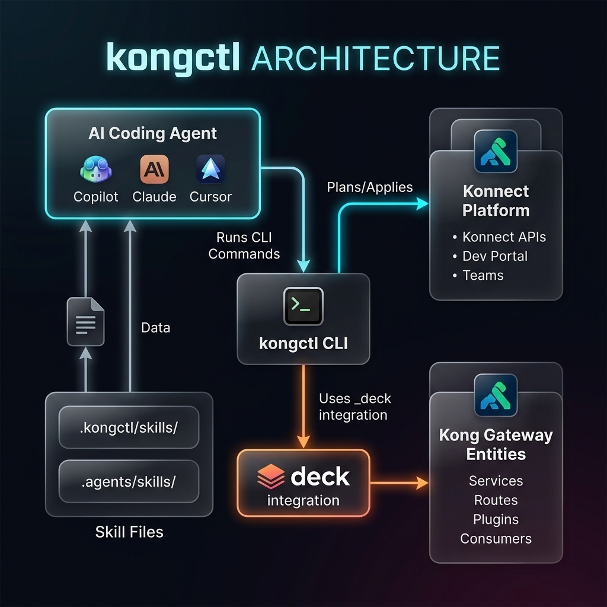

# Addon: kongctl Skills - Bring Your Own Agent

> **What:** Teach AI coding agents to manage Kong Konnect using `kongctl` skills.
> Your agent learns Konnect schemas, scaffolds YAML configs, previews changes,
> and applies them - all from natural language.
>
> **When:** After the core API Gateway module (steps 01–17). Works as a
> standalone 45-minute addon or a 20-minute lightning demo.
>
> **Who:** Any developer with an AI coding agent (Copilot, Claude Code, Cursor,
> Cline, Windsurf, or any agent that reads file-based instructions).

---

## Prerequisites

- Konnect account (same one used for the API Gateway module)
- `kongctl` installed (see [installation](https://developer.konghq.com/kongctl/#installation))
- An AI coding agent (GitHub Copilot, Claude Code, Cursor, etc.)
- decK CLI (already installed from module 01)

## Install kongctl

```bash
# macOS
brew install kong/tap/kongctl

# Verify
kongctl version
```

---

## Architecture



---

## Step-by-Step Guide

### Step 1 - Authenticate with Konnect

```bash
# Interactive login (opens browser)
kongctl login

# Verify
kongctl get portals
```

For CI/CD or non-interactive:
```bash
export KONGCTL_DEFAULT_KONNECT_TOKEN=$KONNECT_TOKEN
```

---

### Step 2 - Install Skills into Your Repo

```bash
# Preview what will be written (no changes)
kongctl install skills --dry-run

# Install skills
kongctl install skills
```

This creates:
```
.kongctl/skills/              ← skill source files
  kongctl-declarative/        ← declarative config workflow skill
  kongctl-extension-builder/  ← CLI extension builder skill
.agents/skills/               ← symlinks for Copilot/Cursor/Cline
.claude/skills/               ← symlinks for Claude Code
```

Verify the files landed:
```bash
ls -la .kongctl/skills/
ls -la .agents/skills/
ls -la .claude/skills/
```

> **What are skills?** Skill files are plain markdown instructions that teach
> your AI agent product-specific workflows. They tell the agent _when_ to use
> `kongctl explain` (discover schemas), `kongctl scaffold` (generate YAML),
> and `kongctl plan/diff/apply` (safe change management). The agent reads
> these files automatically - no configuration needed.

---

### Step 3 - Discover Konnect Schemas with `explain`

Before writing any YAML, your agent (or you) can ask kongctl what fields a
resource supports:

```bash
# What fields does an API resource have?
kongctl explain apis

# What fields does a portal have?
kongctl explain portals

# What about control planes?
kongctl explain control_planes

# Nested: what does an API version look like?
kongctl explain api_versions
```

> **Agent usage:** When your agent encounters an unfamiliar Konnect resource,
> the `kongctl-declarative` skill instructs it to run `kongctl explain` first
> instead of guessing field names. This prevents invalid YAML.

---

### Step 4 - Scaffold Starter YAML with `scaffold`

Generate valid, ready-to-edit YAML for any supported resource:

```bash
# Scaffold an API definition
kongctl scaffold api

# Scaffold a developer portal
kongctl scaffold portal

# Scaffold a control plane
kongctl scaffold control_plane
```

Save and customize the output:
```bash
mkdir -p config
kongctl scaffold api > config/bookstore-api.yaml
```

> **Agent usage:** The skill tells your agent to use `scaffold` as a starting
> point and then customize the generated YAML - rather than writing from scratch.

---

### Step 5 - Write Declarative Config (Agent or Manual)

Create `config/bootcamp-platform.yaml`:

```yaml
# Declarative config for the Bootcamp API platform
# Agent-generated from kongctl scaffold + customization

portals:
  - ref: bootcamp-portal
    name: "bootcamp-portal"
    display_name: "Bootcamp Developer Portal"
    description: "API documentation for bootcamp participants"
    authentication_enabled: false
    default_api_visibility: "public"
    default_page_visibility: "public"

apis:
  - ref: bookstore-api
    name: "Bookstore API"
    description: "CRUD operations for books, authors, and reviews"

    versions:
      - ref: bookstore-v1
        version: "v1.0.0"
        spec:
          content: !file ../../../03-api-portal/openapi/bookstore-api.yaml

    publications:
      - ref: bookstore-publication
        portal_id: !ref bootcamp-portal
        visibility: public
```

> **Key concepts:**
> - `ref` is a local identifier for cross-referencing within the file
> - `!ref` resolves references between resources (e.g., `!ref bootcamp-portal`)
> - `!file` loads external files (specs, docs) relative to the config file
> - `--base-dir` must include the external file path when `!file` points outside `config/`

---

### Step 6 - Preview Changes (Plan & Diff)

Always preview before applying:

```bash
# Generate a plan artifact (JSON file)
mkdir -p plans
kongctl plan --mode apply \
  -f config/bootcamp-platform.yaml \
  --base-dir "$(git rev-parse --show-toplevel)" \
  --output-file plans/bootcamp-plan.json

# Human-readable diff
kongctl diff --plan plans/bootcamp-plan.json
```

The diff output shows exactly what will be created, updated, or deleted:
```
+ portals/bootcamp-portal          CREATE
+ apis/bookstore-api               CREATE
+ api_versions/bookstore-v1        CREATE
+ api_publications/bookstore-pub   CREATE
```

> **Safety rule:** The `kongctl-declarative` skill embeds this pattern:
> _always_ `plan` or `diff` before `apply`. The agent will not skip this step.

---

### Step 7 - Apply the Plan

```bash
# Apply from the saved plan
kongctl apply --plan plans/bootcamp-plan.json

# Or apply directly from config (generates plan internally)
kongctl apply -f config/bootcamp-platform.yaml \
  --base-dir "$(git rev-parse --show-toplevel)"
```

Verify:
```bash
# Check resources were created
kongctl get portals
kongctl get apis
```

---

### Step 8 - Bring Your Agent: Natural Language Exercises

Now the real demo. Ask your AI agent to perform these tasks using kongctl skills:

#### Exercise 1: Create a new API
```
Prompt: "Create a new Konnect API called 'Weather API' with description
'Real-time weather data for cities worldwide'. Use kongctl to scaffold
the config, show me the diff, and apply it after I approve."
```

Expected agent workflow:
1. Runs `kongctl explain apis` (discover schema)
2. Runs `kongctl scaffold api` (generate starter YAML)
3. Writes a YAML config file
4. Runs `kongctl diff --mode apply -f config/weather-api.yaml` (preview)
5. Waits for your approval
6. Runs `kongctl apply -f config/weather-api.yaml`

#### Exercise 2: Publish an API to the portal
```
Prompt: "Publish the Bookstore API v1.0.0 to our bootcamp portal with
public visibility. Load the spec from 03-api-portal/openapi/bookstore-api.yaml."
```

#### Exercise 3: Multi-team namespace isolation
```
Prompt: "Set up namespace isolation so team-payments owns the billing API
and team-platform owns the portal. Use kongctl namespaces and show me how
sync would only affect each team's resources."
```

#### Exercise 4: Full platform setup from scratch
```
Prompt: "Create a complete Konnect setup: a developer portal, two APIs
(Users API and Orders API), publish both to the portal, and deploy them
to the bootcamp control plane with rate-limiting and key-auth via decK
integration. Show me the full plan before applying."
```

---

### Step 9 - Adopt Existing Resources

Resources created via the Konnect UI or API can be adopted under kongctl
declarative management:

```bash
# Bring a UI-created portal under kongctl management
kongctl adopt portal "My Existing Portal" --namespace platform-team
```

This adds kongctl metadata labels to the resource without modifying any other
fields. Once adopted, the resource can be managed declaratively alongside
agent-generated configs.

---

### Step 10 - decK Integration via `_deck`

The power move: manage Konnect platform resources AND gateway entities in a
single workflow. kongctl orchestrates decK for gateway config:

Create `config/full-stack.yaml`:

```yaml
# Platform resources (managed by kongctl)
portals:
  - ref: bootcamp-portal
    name: "bootcamp-portal"
    display_name: "Bootcamp Portal"

apis:
  - ref: bookstore-api
    name: "Bookstore API"
    publications:
      - ref: bookstore-pub
        portal_id: !ref bootcamp-portal

# Gateway entities (managed by decK, orchestrated by kongctl)
control_planes:
  - ref: bootcamp-cp
    name: "PE-Bootcamp"
    _external:
      selector:
        matchFields:
          name: "PE-Bootcamp"
    _deck:
      files:
        - "../../../01-api-gateway/deck/01-services-and-routes.yaml"

    gateway_services:
      - ref: httpbun-gw
        _external:
          selector:
            matchFields:
              name: "httpbun-service"
```

```bash
# Preview everything - platform AND gateway
kongctl diff --mode apply -f config/full-stack.yaml \
  --base-dir "$(git rev-parse --show-toplevel)"

# Apply everything in one command
kongctl apply -f config/full-stack.yaml \
  --base-dir "$(git rev-parse --show-toplevel)"
```

> `kongctl plan` runs `deck gateway diff` under the hood for the `_deck` section.
> `kongctl apply` runs `deck gateway apply`. `kongctl sync` runs `deck gateway sync`.
> Auth flags are injected automatically - don't supply `--konnect-token` yourself.

---

## Quick Reference

### Commands

| Command | Purpose | Safe? |
|---|---|---|
| `kongctl explain <resource>` | Discover resource schemas | Read-only |
| `kongctl scaffold <resource>` | Generate starter YAML | Read-only |
| `kongctl plan -f config.yaml` | Generate plan artifact | Read-only |
| `kongctl diff -f config.yaml` | Human-readable preview | Read-only |
| `kongctl apply -f config.yaml` | Create + update (no deletes) | Additive only |
| `kongctl sync -f config.yaml` | Full reconciliation (creates + updates + **deletes**) | Destructive |
| `kongctl delete -f config.yaml` | Delete all declared resources | Destructive |
| `kongctl adopt` | Bring existing resources under management | Metadata only |
| `kongctl dump` | Export live state to YAML | Read-only |

### YAML Tags

| Tag | Purpose | Example |
|---|---|---|
| `!ref` | Cross-reference resources by `ref` | `portal_id: !ref my-portal` |
| `!file` | Load external file content | `spec: !file ./spec.yaml` |
| `!file path#field` | Extract field from file | `name: !file ./spec.yaml#info.title` |
| `!env` | Load from environment variable | `description: !env API_DESC` |

### Bundled Skills

| Skill | When the agent uses it |
|---|---|
| `kongctl-declarative` | Writing/managing Konnect declarative YAML, running plan/diff/apply workflows |
| `kongctl-extension-builder` | Building custom kongctl CLI extensions (scripts or Go plugins) |

---

## Agent Compatibility

| Agent | Skill location | Auto-loads? |
|---|---|---|
| GitHub Copilot (VS Code) | `.agents/skills/` | Yes - agent mode reads skills |
| Claude Code | `.claude/skills/` | Yes - reads skill files natively |
| Cursor | `.agents/skills/` | Yes |
| Cline | `.agents/skills/` | Yes |
| Windsurf | `.agents/skills/` | Yes |
| Any agent | Point at `.kongctl/skills/` | Manual - add to agent context |

---

## Clean Up

```bash
# Delete resources created during the exercise
kongctl delete -f config/bootcamp-platform.yaml \
  --base-dir "$(git rev-parse --show-toplevel)" \
  --auto-approve

# Or remove specific resources
kongctl get apis
kongctl get portals
```

---

## Key Takeaways

1. **Skills are the bridge** between natural language and Konnect - your agent reads them, learns the workflow, and executes kongctl commands.
2. **`explain` before `scaffold`, `scaffold` before writing** - the agent never guesses field names.
3. **`plan`/`diff` before `apply`, always** - the agent is taught to preview before changing anything.
4. **`apply` is safe (additive), `sync` is powerful (reconciles deletes)** - same distinction as decK.
5. **`_deck` integration** lets you manage platform resources AND gateway entities in a single declarative file.
6. **Any agent works** - skills are plain markdown files, not vendor-locked.

---

## Reference Links

- [kongctl Skills Overview](https://developer.konghq.com/kongctl/skills/)
- [Install Skills Command](https://developer.konghq.com/kongctl/install/skills/)
- [Declarative Configuration Guide](https://developer.konghq.com/kongctl/declarative/)
- [Supported Resources Reference](https://developer.konghq.com/kongctl/supported-resources/)
- [kongctl + decK Integration](https://developer.konghq.com/kongctl/kongctl-and-deck/)
- [Example Declarative Configs (GitHub)](https://github.com/Kong/kongctl/tree/main/docs/examples/declarative/)
